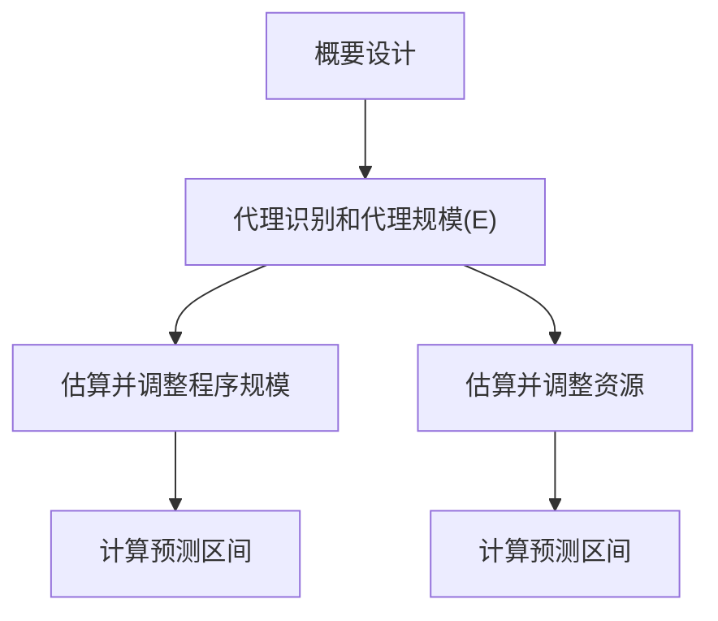

# 软件质量管理期末复习资料

> 复习策略：先背高频简答题模板，再刷选择题易错点；DevOps 是今年新加入考点，历史频率不能完全反映重要性，按高优先级处理。

## 标注说明

- `已考`：在往年卷、往年题整理或课上选择题中出现过。
- `课上测`：在 2026 课件/课堂测试中出现过，虽不一定是往年期末真题，但今年复习优先级较高。
- `新增`：今年新加入或今年课件明显强化。
- `未见真题`：材料中有知识点，但目前未在已整理往年题中看到明确考题；仍然保留，防止覆盖不足。
- 星级只表示复习优先级，不表示低星级可以完全不看。

## 考频总览

| 优先级 | 主题 | 考频标注 | 典型题型 |
|---|---|---:|---|
| 必背 | 项目计划、估算、PROBE、WBS、EVM | ★★★★★ | 简答、计算/判断、选择 |
| 必背 | PSP 质量指标：A/FR、PQI、DRL、Yield、评审 | ★★★★★ | 简答、选择、综合论述 |
| 必背 | CMMI、过程管理/改进、PDCA、IDEAL | ★★★★★ | 判断说明、简答 |
| 必背 | 需求开发、V&V、集成策略、配置管理、根因分析 | ★★★★★ | 简答、选择 |
| 必背 | 软件发展三阶段、本质困难、生命周期/瀑布 | ★★★★☆ | 简答、选择 |
| 必背 | 敏捷宣言、Scrum、XP、Kanban | ★★★★☆ | 简答、选择、比较 |
| 重点 | 团队动力学、TSP、自主团队、激励理论 | ★★★★☆ | 简答、选择 |
| 新重点 | DevOps、CI/CD、微服务、容器、云原生 | ★★★★☆ + 新增 | 简答、论述、选择 |
| 新趋势 | AI 时代的软件工程影响 | ★★★☆☆ | 开放论述 |

## 一、软件过程与历史演变 ★★★★☆

### 0. 课程总论：为什么软件工程需要管理

考察情况：未见明确往年真题，但课程介绍和总论课件出现，可作为开放题素材。

- 管理三要素：目标、状态、纠偏。
- 软件项目三目标：成本、质量、工期。
- 软件开发天然有”熵增”倾向：需求膨胀、沟通混乱、设计退化、缺陷累积都会让系统从有序走向无序。
- 管理不是形式主义，而是通过计划、跟踪、评审、配置管理、度量和过程改进让目标、状态、纠偏形成闭环。

**软件危机**：落后的软件生产方式无法满足迅速增长的计算机软件需求，导致软件开发与维护过程中出现一系列严重问题的现象。

**软件工程**：一门研究用工程化方法构建和维护有效的、实用的和高质量的软件的学科。两大视角——管理视角（能否复制成功？）和技术视角（是否可以将问题解决得更好？）。

**广义软件过程**：包括技术、人员以及狭义过程。广义软件过程的同义词包括软件开发方法、软件开发过程。例子：净室（Cleanroom）方法、极限编程（XP）、SCRUM 方法、Gate 方法；更一般地，敏捷软件过程/方法、轻量型过程/方法以及重型过程/方法等描述也是恰当的。

**软件项目管理 vs 软件过程管理**（类比）：软件项目管理像产品生产管理（保证当前产品交付），软件过程管理像流水线的设计、建设、维护、优化以及升级改造（提升长期能力）。

### 1. 软件发展的三大阶段

考察情况：已考 2018、2020 简答；2022/2023 选择题也考三阶段和典型实践。DevOps 属今年新增强化点。

**软硬件一体化**

- 特点：软件依附硬件，功能单一，复杂度有限，需求变更少。
- 典型方法：`Measure twice, cut once`、Code and Fix、线性顺序过程。
- 易错：`Measure twice, cut once` 在往年选择题中常被解释为偏代码评审/改动前检查的场景。

**软件成为独立产品**

- 特点：操作系统和个人电脑推动软件独立，功能增强，兼容性和市场压力上升，需求更易变化。
- 典型方法：形式化方法、结构化程序设计、瀑布模型、成熟度运动。

**网络化和服务化**

- 特点：规模更大，用户更多，快速演化，需求不确定，分发方式变化，开源共享文化盛行。
- 典型方法：迭代式开发、敏捷方法、开源开发、DevOps。

**开源软件开发方法**（课件第二讲重点）：

- 基于并行开发模式的软件开发组织与管理方式。
- Linus 定律："如果有足够多的 beta 测试者和合作开发者，几乎所有问题都会很快显现，然后自然有人会把它解决。"
- 核心实践："早发布，常发布，倾听用户的反馈"；"把你的用户当成开发合作者对待"；"设计上的完美不是没有东西可以再加，而是没有东西可以再减"。
- 严格的代码提交社区审核制度。
- 演化形式：内部开源（Inner Source）、众包（Crowdsourcing）。

### 2. Brooks 本质困难

考察情况：已考 2020-mid 和 2022/2023 选择题，常见陷阱是把“质量挑战”混入本质困难。

常考四类：复杂性、不可见性、可变性/一致性相关挑战。选择题中“质量挑战”常作为干扰项。

答题要点：本质困难不是完全无法缓解，而是根植于软件特性；不同历史阶段凸显程度不同。

### 3. 生命周期模型 vs 软件过程

考察情况：已考 2018、2020 简答。

- 生命周期模型是对软件开发过程的人为划分，是粗粒度框架。
- 软件过程包含更具体的活动、角色、工件、技术实践和管理实践。
- 生命周期模型通常不包含具体技术实践。

### 4. 瀑布模型如何理解

考察情况：已考 2020 简答。

- 瀑布模型不是单一模型，而是一系列模型，覆盖从简单到复杂的过程元素组合。
- 项目挑战越多，所需过程元素越复杂。
- 常见失败原因：团队低估项目挑战，选择了过于简单的瀑布模型。

## 二、过程管理、CMMI、PDCA/IDEAL ★★★★★

### 1. 项目管理 vs 过程管理

考察情况：已考 2018 简答；2022/2023 判断题考“软件过程管理是不是项目管理目标”。

- 软件项目管理：应用方法、工具、技术和人员能力完成项目目标。
- 软件过程管理：让组织/团队的软件过程在效率、质量等方面有更好绩效。
- 易错：软件过程管理不是软件项目管理“应该实现的目标”，二者不是一回事。

### 2. CMMI 五级

考察情况：已考 2020、2022/2023 简答，常和“4/5 级为何是高等级”一起考。

| 等级 | 名称 | 核心特征 |
|---|---|---|
| 1 | Initial 原始级 | 混乱，依赖个人英雄主义，救火文化 |
| 2 | Managed 已管理级 | 项目层面有计划、跟踪、需求管理、配置管理 |
| 3 | Defined 已定义级 | 组织层面有标准过程，项目可裁剪 |
| 4 | Quantitatively Managed 定量管理级 | 用统计过程控制和预测模型管理过程 |
| 5 | Optimizing 优化级 | 持续识别偏差、根因并改进 |

四级、五级被称为高等级，因为它们不是只关注当前过程是否被执行，而是用量化模型、统计方法和结果反馈管理未来表现。具体来说：

- 等级 2、3 关注的是**当前状态**——过程是否在按照计划执行，是否满足了基本的项目管理和过程定义要求。
- 等级 4（定量管理级）用**统计过程控制（SPC）**和预测模型来管理过程，能够根据量化数据预判过程未来的表现。
- 等级 5（优化级）在此基础上**主动识别偏差、找到根因并消除**，避免未来继续发生类似问题，实现持续优化。
- 本质差别：等级 2/3 是"做对的事情"，等级 4/5 是"用数据证明做得对，并持续做得更好"。高等级从**被动反应**（救火）转向**主动预测和管理**未来表现。

### 3. CMMI 与敏捷不对立

考察情况：已考 2020、2022/2023 判断说明。

- CMMI 是过程管理/改进模型。
- XP、Scrum 等多数敏捷方法是开发方法或过程框架。
- 二者性质不同，不能简单对立；敏捷环境也可以做过程改进。
- SPICE（Software Process Improvement and Capability dEtermination，ISO/IEC 15504）与 CMMI 同为软件过程管理参考模型，用于过程评估和改进。

### 4. PDCA 与 IDEAL

考察情况：已考 2015B、2016 简答；2022/2023 判断题考“是否适合敏捷环境”。

PDCA：Plan、Do、Check、Act。可展开为：找问题、分析原因、制定措施、执行、检查效果、标准化经验、遗留问题进入下一轮。

IDEAL：Initiating、Diagnosing、Establishing、Acting、Leveraging。

易错：PDCA/IDEAL 是过程改进参考模型，适合敏捷环境。

## 三、敏捷、Scrum、XP、Kanban ★★★★☆

### 1. 敏捷宣言

考察情况：已考 2020、2022/2023 简答。

- 个体和互动胜过流程和工具。
- 可以工作的软件胜过详尽的文档。
- 客户合作胜过合同谈判。
- 响应变化胜过遵循计划。
- 注意：右项有价值，只是更重视左项。

**Standish Group 项目成功分类**：

- 传统分类：Successful（按时按预算完成所有功能）、Challenged（完成但超预算/超期/功能少于规格）、Impaired（开发中途被取消）。
- 敏捷观点：**为客户创造价值**才是项目成功的最重要标准。好的敏捷项目往往会建造出与最初计划不同却更好的软件。

**敏捷与工程方法的本质区别**：

- 敏捷型方法是**适应性而非预见性**的、**面向人而非面向过程**的。
- 工程方法（计划驱动方法）借鉴土木工程思路，将"设计与建造分离"。
- 两者不是简单的轻重之分，而是根本哲学差异。

**度量失效机制**（古德哈特定律相关）：

- 当度量没有涵盖影响效能的所有重要因素时，干活的人会改变工作方式去迎合指标，造成度量"失效"。
- 例：度量代码行数 → 制造冗余代码；度量关闭 bug 数 → 倾向于关闭简单 bug。

**Alistair Cockburn**：软件开发中的"人"是"非线性、一阶的部件"——不能像制造业流水线一样把人当可替换插件。

**McConnell**：大型软件项目中编码和单元测试仅占约 15% 的工作量。

### 2. 不要误解敏捷

考察情况：已考 2014、2015A、2015B、2016、2020，常要求解释为什么“严格/重型/计划驱动”不适合作为敏捷对立面。

- “轻量级”“不计划”“不严格”都容易误导。
- 优秀敏捷方法也很严格；所有正式项目都需要计划；所有软件方法都要管理变更。
- 敏捷的核心更接近：小周期迭代、持续交付、快速反馈、价值交付、技术卓越。

### 3. Scrum

考察情况：2026 Scrum 课堂测试密集覆盖；往年主要以敏捷大题/比较题间接出现。

Scrum 是复杂产品开发框架，不是具体技术过程。

记忆：`33355/3355`

- 3 个角色：Product Owner、Scrum Master、Developers。
- 3 个工件：Product Backlog、Sprint Backlog、Increment。
- 5 个事件：Sprint、Sprint Planning、Daily Scrum、Sprint Review、Sprint Retrospective。
- 5 个价值观：承诺、专注、开放、尊重、勇气。

三大支柱：透明、检视、适应。

Scrum 与 XP：Scrum 管项目/团队协作，XP 管工程实践。Scrum 是容器，XP 可作为其中的技术实践。

2026 课堂测试细项：

- Scrum 一词作为新产品开发术语由竹内弘高与野中郁次郎在 1986 年提出。
- Scrum Team 通常 10 人或更少。
- Daily Scrum 时间盒是 15 分钟。
- Sprint 当前行业常见周期约 2 周，Scrum Guide 中最长一个月。
- Product Backlog 排序权归 Product Owner。
- 用户故事模板：`作为 <某类用户>，我想 <做某事>，从而 <获得某种价值>`，对应 `who / what / why`。
- 用户故事 3C：Card、Conversation、Confirmation。用户故事是占位符，不是完整需求。
- INVEST 完整展开：**I**ndependent（独立）、**N**egotiable（可协商）、**V**aluable（有价值）、**E**stimable（可估算）、**S**mall（短小）、**T**estable（可测试）。—— 课程选择题常考 I 的英文全称。
- Planning Poker 常用斐波那契数列。
- DoD 是团队对“完成”的统一定义，用来判断增量是否真正可交付。
- Scrum Guide 2020 取消 “Development Team” 称谓，统一为 Developers。
- PO 每天给开发者分配小时级任务是微观管理，违反自管理原则。
- 估算价值不在精确预测，而在建立共同理解、暴露分歧。
- Sprint Goal 不应被单方面改写；范围可在不破坏目标前提下与 PO 协商，质量不可让步。
- 演示完成不等于价值传递成功；用户反馈应进入下一轮 Backlog 调整。
- AI Agent 时代，AI 代码若无人能解释，会积累理解力负债；DoD 可加入”至少一名成员能解释核心设计决策”。

**”猪与鸡”比喻**：

- 猪（核心成员，全身投入）：PO、Scrum Master、Developers。
- 鸡（利益相关者，参与但不决策）：用户、客户、经理等。

**大规模敏捷**（课件出现，选择题可能考）：

- SAFe（Scaled Agile Framework）：团队层 → 项目群层(ART) → 解决方案层 → 组合层。争议：过于繁重，”披着敏捷外衣的瀑布”。
- LeSS（Large-Scale Scrum）：基本 LeSS（2-8 团队）、LeSS Huge（8+ 团队）。一个 PO、共享 Product Backlog、同一 Sprint。

**AI 时代对 Scrum 的冲击**（2026 新增重点）：

- 角色冲击：从跨职能团队到人-Agent 混合团队；开发者从代码编写者变为 Agent 编排者。
- PO 挑战：Backlog 粒度重新校准；TDD 成为向 Agent 传达需求的精确语言。
- SM 新使命：管理人-Agent 协作流动性；识别瓶颈漂移（评审变成新瓶颈）；**约束理论(TOC)**——优化非瓶颈不会提高产出。
- 工件冲击：Testable 从”最佳实践”升级为”生存必需品”。
- 质量新风险（Faros AI 数据）：PR 数量 +98%、PR 规模 +154%、bug 率 +9%；表面正确性 ≠ 系统正确性。
- AI 代码生成速度是人类理解速度的 5-7 倍，造成理解力负债。

### 4. XP

考察情况：2026 XP 课堂测试密集覆盖；往年敏捷题中也出现 XP/TDD/CI 误解。

核心价值观：沟通、简单、反馈、勇气、尊重。

基本活动：编码、测试、倾听、设计。

高频实践：

- TDD：红、绿、重构。
- 持续集成：频繁合入主线，自动构建和测试。
- 重构：不改变外部可见行为，只改善内部结构。
- 简单设计与 YAGNI：不是粗糙，而是以测试和重构能力为支撑。
- 结对编程、集体代码所有权、编码标准、40 小时工作制。

CI/CD 易错：

- CI：自动构建 + 快速测试，代码频繁集成到主线。
- CD/持续交付：流水线自动到类生产，只剩上线按钮。
- 持续部署：连上线也自动化，只保留紧急刹车。

2026 课堂测试细项：

- XP 起源项目：克莱斯勒 C3 薪资系统。
- XP 的四项基本活动：编码、测试、倾听、设计。
- 简单设计四规则：通过所有测试、消除重复、清晰表达意图、最小化元素。
- TDD：Red → Green → Refactor。
- CI 不是工具，而是团队协议：每天至少一次合入共享主线。
- 提交阶段反馈通常应控制在 10 分钟内。
- 主线构建坏了，首选快速回到上一个绿色状态，例如 revert 问题提交。
- 长期分支上的自动化构建不等于 CI；CI 的“集成”指合回主线。
- 没有自动化测试的 CI 会让坏代码更快合入，变更成本曲线重新变陡。
- 重构是不改变外部可见行为、只改善内部结构；改变行为是功能变更。
- 集体代码所有权不是无人负责，需要测试、结对、CI、编码标准支撑。
- 40 小时工作制不是机械数小时，而是反对长期加班掩盖计划、范围、设计、测试问题。
- AI 时代 TDD 可理解为规格驱动开发：先把业务理解编码为可执行规格，再让 AI 在规格约束下生成实现。

**变更成本曲线**（XP 理论基石，2026 课件重点）：

- Boehm 1981 数据：需求阶段修复成本 1x → 设计 5x → 编码 10x → 测试 20x → 上线 100x。
- 传统瀑布假设曲线指数增长 → 需求必须锁死、设计必须覆盖未来、测试留到最后。
- Kent Beck 1996 在 C3 项目押注"把指数线拉平"——通过 TDD、CI、重构三件套把反馈周期从几个月缩到几分钟（约 10³ 倍差距），不给成本指数增长的机会。
- **平坦曲线的五根支柱**：面向对象（修改局部化）、简单设计（不写多余的）、自动化测试（安全网）、重构技术（敢于改）、CI/CD（频繁集成部署）。
- 平坦是结果而非福利——拿掉任一支柱，曲线立刻陡回去。

**未完成功能的处理技术**（XP 课件 2026 重点）：

- **Feature Toggle**：代码里加配置开关，未完成功能默认关；按环境或用户分组开放；上线后可灰度、可紧急关闭。
- **Branch by Abstraction**：大规模重构时引入抽象层，新旧实现并存，通过配置切换逐步迁移，完成后删旧实现和抽象层。
- **Dark Launch**：新功能部署到生产但对用户不可见，做内部监控和压测，信心足够后再开放。
- 三者共同点：把"代码部署"和"功能发布"解耦。

**结对编程经济账**：

- 成本面：+15% 开发时间；管理层直觉反对。
- 收益面：-15% 缺陷；知识实时传递；复杂任务上设计质量显著更高。
- 简单算术：修一个生产 bug 平均 4 小时，100 行代码减 2 个 bug，15% 的额外投入换更低维护成本——是投资时机的选择。

**TDD 实证数据**：

- 缺陷密度：比非 TDD 低约 45%。
- 初始开发时间：比非 TDD 高约 16-30%。
- 3 年维护成本：比非 TDD 低约 50%+。
- 难以测试的代码几乎总是设计有问题的代码——测试困难度本身就是设计质量的客观反馈。

**DORA 2024 数据**（39,000+ 专业人员，课件出现）：

- 部署频率：Elite vs Low 差距 182 倍。
- 变更失败率：Elite vs Low 低 8 倍。
- Elite 团队：前置时间 < 1 小时，恢复时间 < 1 小时。
- 2024 新信号：50.2% 受访者在 CI/CD 中使用 AI 工具。

**Dark Scrum 警示**（Ron Jeffries）：

- Sprint 规划准时、Poker 估点齐整，但测试覆盖率接近零、CI 常红没人认领、"代码能跑就不要动"——只有 Scrum 仪式没有 XP 工程实践的团队。
- Fowler 2018："没有技术卓越的敏捷，是一种赶死加速。"技术卓越 = TDD + CI + 重构 + 简单设计。

**AI 时代 XP 实践新形态**：

- CI → 持续验证（Continuous Verification）：不仅验证编译和测试，还验证 AI 代码是否符合安全/架构/业务规则。
- TDD → 规格驱动开发（Specification-Driven Development）：工程师定义精确规格，AI 在规格约束下生成实现。
- 结对 → 三方协作（Human + AI + Reviewer）：AI 扮演初级工程师，资深工程师专注设计决策和质量把关。
- 核心不变：当代码生成不再是瓶颈，工程师的核心价值变成——知道什么是正确的，以及如何验证它。

### 5. Kanban

考察情况：2020-mid 已考看板典型实践；2026 Kanban/Lean 课堂测试强化。

核心实践：

- 可视化工作流。
- 限制 WIP。
- 管理流动。
- 显式化流程规则。
- 建立反馈循环。
- 协作式改进。

与 Scrum 区别：

- Scrum 有固定角色、事件、时间盒；Kanban 通常不强制角色和迭代。
- Scrum 在 Sprint 中通常不接受变更；Kanban 可连续拉取和调整优先级。
- Kanban 更适合持续流、维护、需求变化频繁或不便固定 Sprint 的场景。

2026 课堂测试细项：

- Kanban 不是“电子待办列表”，缺少 WIP 限制、显式策略和反馈循环，就只有看板的形。
- WIP 限制的目标是暴露瓶颈、减少排队和上下文切换，不是单纯限制大家少干活。
- 遇到瓶颈列积压，应先疏通瓶颈，而不是继续往前端推更多工作。
- 局部最优不等于全局最优；开发更快但测试积压，会让整体交付更慢。
- Scrum 有角色、事件、时间盒；Kanban 更强调从现有流程开始，逐步演进。

**Kanban 核心度量**（2026 课件重点）：

- **WIP**（在制品）：已开始但未完成的工作项数量。
- **Throughput（产能）**：每单位时间内完成的工作项数量。
- **Cycle Time（周期时间）**：工作项从正式开始处理到完成交付之间的总时长。
- **Lead Time（交付时间）**：通常还包括需求提出到启动前的等待时间，Lead Time ≥ Cycle Time。
- **Work Item Age（工作项存续时长）**：工作项从开始到当前时刻的时间。
- **SLE（Service Level Expectation，服务水平期望）**：如"85% 的工作项将在 8 天或更短时间内完成"。
- **Aging Thresholds（预警线）**：帮助团队主动识别需要额外关注的任务。

**Little 定律**（排队论在 Kanban 中的应用）：

```text
L = λW
```
- L：平均在制品数量
- λ：平均到达率
- W：平均周期时间

**WIP 上限参考值**：团队人数 × 2/3 ~ 3/4 是效率最优区间。

**AI Agent 时代的 Kanban**：

- 瓶颈从"写代码"转移到"规划与审查"。
- 两层 WIP 限制：Agent 层 WIP（同时运行的 Agent 数量，推荐 3-5）+ 人类审查层 WIP（等待审查的已完成 Agent 任务数量）。
- 这是 Agent 时代 Kanban 的关键创新。

### 6. 精益软件开发

考察情况：2026 Kanban/Lean 课件强化，老往年题较少直接考；今年应按选择题重点看。EagleBear 列出"精益屋的两大支柱""JIT、价值流和价值拉动的关系"为考点。

**精益屋两大支柱**：

- **准时化（JIT, Just In Time）**：建立"拉动式"系统，按下游需求触发上游生产，消除库存与等待。软件对应：按用户故事拉取，而非按容量推送。
- **自働化（Jidoka）**：内建质量，赋予人和机器"停止生产线"的权力。自働化 ≠ 自动化——"働"比"動"多一个"亻"（人）旁，强调带有人类判断的自动化。软件对应：CI 红灯即阻塞合并、type checker 失败即停手、任何工程师有权拉停有风险的流水线。

**JIT、价值流与价值拉动**：JIT 的核心是价值拉动——下游（客户/后道工序）发出需求信号，上游才生产，避免过度生产和库存积压。价值流是从需求到上线的端到端过程，目标是消除任何不创造价值的环节。

**精益七大原则（Poppendieck）**：

- 消除浪费（Eliminate Waste）。
- 内建质量（Build Quality In）。
- 创建知识（Create Knowledge）。
- 推迟决策（Defer Commitment）：把关键决策推到"最后责任时刻"，在信息最充分时做最优选择。
- 快速交付（Deliver Fast）：缩短 Cycle Time，最有效手段是严格限制 WIP。
- 尊重人（Respect People）：内在驱动力——自主（Autonomy）、专精（Mastery）、目的（Purpose）；心理安全。
- 全局优化（Optimize the Whole）：局部最优 ≠ 全局最优。

**核心思想**：

- 识别价值，消除浪费。
- 管理价值流，而不是只优化局部环节。
- 限制 WIP，减少等待和切换。
- 内建质量，把质量问题尽早暴露并停线处理。
- 持续改进。

**常见浪费**：

- 未完成工作（半成品 PR、未合并分支）。
- 多余功能（用户从不点的按钮）。
- 重新学习（同一个坑反复踩）。
- 交接。
- 延迟（等评审、等环境、等审批）。
- 任务切换。
- 缺陷。
- 不必要的复杂性（过度设计、抽象层堆叠）。

**自働化与自动化**：

- 自动化强调机器自己运行。
- 自働化强调带有人类判断的自动化，发现异常能停线。
- 软件工程对应：CI 红灯即停止合并，测试失败阻塞发布，任何工程师有权拉停有风险的流水线（andon cord 概念）。

## 四、项目计划、估算、PROBE、WBS、EVM ★★★★★

### 1. 通用计划框架

考察情况：已考 2020 简答；“无法拒绝的计划”在 2013、2014、2015A、2015B、2016 多次出现。

基本链路：客户需求 → 定义需求 → 概要设计 → 规模估算 → 资源估算 → 日程计划 → 开发产品 → 收集规模/资源/日程数据 → 过程分析。

要点：

- 正推，不是从截止日期倒推。
- 需求定义和概要设计需要人工判断。
- 规模和资源估算可借助历史数据和模型。
- 日程计划部分依赖模型，部分依赖团队资源水平等人工判断。

### 2. 对估算的认识

考察情况：已考 2013、2015A、2018；2023 考过规模估算基本要点。

- 估算本质上是猜测，但目标是提高一致性和可信度。
- 规模估算更适合利用历史数据，因为偏差原因相对客观。
- 时间估算受人的主观能动性影响，历史时间数据不一定可靠。
- 估算过程也是干系人达成共识的过程。

### 3. PROBE

考察情况：已考 2013、2015A、2018、2020，属于高频简答。

PROBE：Proxy Based Estimation。

基本思想：

- 用代理规模连接早期规划需要和后期精确度量。
- 估算相对大小，而非直接追求绝对精确。
- 依赖高质量历史数据和一致过程。

**PROBE 估算流程**（2020 考过流程图，可按步骤简答）：



**PROBE 估算时间为什么不用历史生产效率数据**（2020 独立考点）：

- 在估算资源需求（人时）时，生产效率在分母上。
- 个体软件工程师生产效率波动大，导致估算偏差范围变大。
- 所以 PROBE 方法用代理规模→规模的回归代替直接用生产率倒推。

优点：过程定义清楚，可积累数据，可用统计方法调整估算，提高信心。

缺点：高度依赖历史数据质量；数据缺失或不稳定时偏差显著。

### 4. WBS

考察情况：已考 2022/2023 选择题。

- WBS 是工作分解结构，是范围管理基础。
- WBS 的底层工作包应能完整支撑目标实现。
- WBS 与 OBS 可以建立责任分配关系，但 WBS 本身按工作/交付物分解，OBS 按组织职责分解，不要机械认为二者必须一一对应。
- 同一层分解应尽量使用一致标准，否则容易造成范围遗漏或重复。

### 5. EVM

考察情况：已考 2020-mid、2022/2023 选择题；课件含公式，可能考计算或判断。

EVM 可用于跟踪进度和成本，依赖估算准确性，也可适应一定需求变更。

核心变量：

- `PV`：Planned Value，计划值。
- `EV`：Earned Value，挣值。
- `AC`：Actual Cost，实际成本。
- `BAC`：Budget At Completion，完工预算。

常用公式：

```text
SV = EV - PV
SPI = EV / PV
CV = EV - AC
CPI = EV / AC
EAC = AC + (BAC - EV) / CPI
EAC = BAC / CPI
```

三种实现：

- 简单实现：建立 WBS，为每项工作定义计划价值，按完成情况转化为挣值。实际成本不影响挣值。
- 中级实现：在简单实现基础上计算进度偏差（`SV`、`SPI`），不引入成本信息。
- 高级实现：加入成本线 `AC`、预算线 `BAC`，计算 `CV`、`CPI`、`EAC`。

燃尽图：显示剩余工作量随时间变化，常用于 Sprint 跟踪；可理解为关注剩余工作下降趋势的进度跟踪方式。

易错：

- “EVM 不适用于质量管理”通常是正确判断方向。
- 中级实现不引入成本信息；成本信息属于高级实现。
- EVM 高度依赖估算准确。

### 7. 风险管理

考察情况：PPT 第一讲、第四讲提到风险管理、风险计划跟踪。

风险应对策略：

- **规避**：改变项目计划以消除风险或保护项目目标。
- **转移**：将风险影响和应对责任转移给第三方。
- **缓解**：降低风险发生概率或减少影响。
- **接受**：不采取主动措施，准备在风险发生时再处理。

## 四点五、TSP、团队角色与计划会议 ★★★★☆

### 1. TSP 与 PSP

考察情况：TSP 角色已考 2016、2021；TSP 与 Scrum 对比已考课上选择；TSP Launch 已考 2020-mid 选择。

- PSP：Personal Software Process，个人软件过程，强调个人计划、度量、缺陷管理和质量控制。
- TSP：Team Software Process，团队软件过程，把 PSP 的计划、质量、度量扩展到团队协作层面。

### 2. TSP 角色

考察情况：已考 2016、2021 简答，通常要求列出 TSP 角色并解释其中 5 个职责。

可背 5 个职责即可应对简答：

- 项目组长/项目经理：建设和维持高效率团队，激励成员，主持会议，汇报状态，分配任务，组织总结。
- 计划经理：开发团队计划和个人计划，平衡计划，跟踪项目进度。
- 开发经理：制定开发策略，开展规模和资源估算，负责需求、高层设计、实现、集成测试等开发活动。
- 质量经理：制定和跟踪质量计划，警示质量问题，组织协调评审。
- 过程经理：维护过程数据、开发标准、会议记录，支持过程改进。
- 支持经理：保证工具环境，主持配置管理，维护风险/问题跟踪系统，支持复用策略。

### 3. TSP Launch 10 次会议

课件顺序可按“目标-角色-策略-计划-质量-风险-再平衡-管理汇报-启动后跟踪”来记：

- Meeting 1：建立产品和业务目标。
- Meeting 2：分配团队角色，明确职责。
- Meeting 3：确定开发策略。选择题常考“开发策略是第几次会议”，答案是第 3 次。
- Meeting 4：制定总体计划。
- Meeting 5：制定质量计划。
- Meeting 6：制定个人计划。
- Meeting 7：风险评估。
- Meeting 8：计划再平衡。
- Meeting 9：管理层评审。
- Meeting 10：项目启动/复盘启动承诺。

### 4. TSP 与 Scrum

考察情况：已考课上选择题，常考“二者是否一个计划驱动一个敏捷”“是否只适合某类生命周期”。

共性：

- 都是过程框架，需要填入具体工程实践。
- 都强调团队协作、角色职责和过程透明。
- 都需要度量数据支持管理决策。

易错：

- 不要说“TSP 是计划驱动，Scrum 是敏捷，所以两者对立”。计划驱动与敏捷不是绝对反义词。
- 不要绝对说“Scrum 只适合迭代，TSP 只适合瀑布”。两者可以结合不同实践使用。

## 五、PSP 质量管理与质量指标 ★★★★★

### 0. 软件质量观

考察情况：课件出现，未见集中大题；可用于质量管理论述题。

软件质量：与软件产品满足规定和隐含需求能力有关的特征或特性的全体。

常见视角：

- 需求满足：不仅满足明确规定的需求，也要满足隐含需求。
- 用户价值：质量最终体现为产品对用户/人的价值。
- 主观性：不同用户对同一软件可能有不同质量判断。
- 内部质量：结构、可维护性、可理解性等，不一定直接被用户看到。
- 外部质量：可靠性、易用性、性能等面向用户体验的质量。
- 过程视角：产品质量很大程度上受过程质量影响，所以要用评审、度量、缺陷预防、过程改进来管理质量。

软件质量的四种经典定义：

- ANSI/IEEE Std 729：与软件产品满足规定的和隐含的需求能力有关的特征或特性的全体。
- 《代码大全》：软件质量为内外两部分的特性——外部质量特性面向最终用户，内部质量特性不直接面向最终用户。
- Tom DeMarco：软件质量为软件产品可以改变世界、使世界更加美好的程度。从用户角度考察，用户满意度是最重要的判断标准。
- Gerald Weinberg：软件质量为对人（用户）的价值。强调质量的主观性——不同用户对同一软件有不同的质量体验。

### 0.5 面向用户的质量观

考察情况：PPT 第五讲有此概念。

定义质量为**满足用户需求的程度**。需明确：用户是谁、需求优先级是什么、对开发过程产生什么影响、怎样度量。

典型用户质量期望：软件必须能工作 → 有较快的执行速度 → 在安全性、保密性、可用性、可靠性、兼容性、可维护性、可移植性等方面表现优异。

### 0.8 Humphrey：软件过程之父

考察情况：PPT 多次提及；Humphrey 提出 CMM、PSP、TSP。

- 采用 Crosby 的成熟度度量，提出 CMM。
- 提出 PSP（个人软件过程）和 TSP（团队软件过程）。
- 将统计质量控制思想引入软件工程。

### 1. PSP 质量策略

考察情况：已考课上选择题，常和“外部质量/内部质量”“评审比测试高效”一起考。

核心思想：用缺陷管理替代抽象的质量管理；尽早通过高质量评审消除缺陷。

基本逻辑：

- 缺陷存在越久，消除成本越高。
- 代码评审/设计评审通常比后期测试更高效。
- 测试不能被取消，但应尽量让缺陷在模块内部、上游阶段被发现。
- 高质量产品意味着组件基本无缺陷；基本无缺陷主要通过高质量评审实现。
- 测试发现缺陷多，往往说明前期质量差，不应把“测出很多 bug”当作质量好。

### 1.5 PSP 缺陷日志

考察情况：已考 2023 选择题。

缺陷日志用于缺陷分析、质量预测、根因分析和过程改进，不只是记录“发现了几个缺陷”。

重要字段：

- 发现时间/发现阶段。
- 注入阶段与消除阶段。
- 缺陷类型和描述。
- 修复时间。
- 根因描述。
- 重现方式。
- 关联缺陷或由修复引入的新缺陷。

### 2. A/FR

考察情况：已考 2015、2015A、2018；课上选择题也出现。

`A/FR = PSP 质检成本 / PSP 失效成本`

- 质检成本：设计评审时间 + 代码评审时间。
- 失效成本：编译时间 + 单元测试时间。
- PSP 中期望值约为 2.0。
- 过低：评审不足；过高：可能评审过度、效率下降。

### 3. PQI

考察情况：已考 2013、2015、2018、2023 选择题。

PQI 是过程质量指标，通常为 5 个因子的乘积，每个因子在 0 到 1 之间，越接近 1 越好。

五个因子：

- 设计质量：设计时间应大于编码时间。
- 设计评审质量：设计评审时间应大于设计时间的 50%。
- 代码评审质量：代码评审时间应大于编码时间的 50%。
- 代码质量：编译缺陷密度应低。
- 程序质量：单元测试缺陷密度应低。

用途：判断模块开发质量、规划质量活动、指导过程改进。

易错：PQI 不是越低越好，也不是“大于 1 才好”；通常越接近 1 越好。

常用公式版本：

```text
设计质量 = min(设计时间 / 编码时间, 1)
设计评审质量 = min(2 * 设计评审时间 / 设计时间, 1)
代码评审质量 = min(2 * 代码评审时间 / 编码时间, 1)
代码质量 = min(20 / (编译缺陷密度 + 10), 1)
程序质量 = min(10 / (单元测试缺陷密度 + 5), 1)
PQI = 上述五项乘积
```

### 4. DRL

考察情况：已考 2023 选择题。

DRL 用单元测试阶段作为基准，考察上游缺陷消除阶段相对单元测试的缺陷消除效率。课程资料里常按“每小时发现缺陷数”理解，即比较不同阶段发现缺陷的效率。

```text
DRL = 某阶段每小时发现缺陷数 / 单元测试每小时发现缺陷数
```

易错：DRL 是度量指标，不是只能预测；题干若问“以什么作为基准”，注意区分“单元测试阶段/单元测试发现率/单元测试发现缺陷数”的表述。

### 5. Yield

考察情况：已考 2013、2021；课上选择题出现 Phase Yield / Process Yield。

- Phase Yield：某一阶段消除缺陷的比例。
- Process Yield：过程整体消除缺陷的比例。
- Yield 可用于缺陷预测模型和过程改进。

Yield 计算公式（理解为主，辅助判断）：

```text
Phase Yield = 100 × (某阶段发现的缺陷数) / (该阶段注入的缺陷数 + 进入该阶段前遗留的缺陷数)
Process Yield = 100 × (第一次编译前发现的缺陷数) / (第一次编译前注入的缺陷数)
```

基于 Yield 的缺陷预测模型：

- 利用历史数据估计缺陷注入率和缺陷消除率。
- 输入包括规模、文档规模、人员规模、各阶段缺陷注入/消除密度和速度。
- 可用回归技术建模，并在项目进行中用实际数据反馈修正。
- 改进方案：引入更多影响因子，维护高质量历史数据，假设分布后用蒙特卡罗模拟。

### 6. Review Rate 与 Quality Journey

考察情况：Review Rate 已考课上选择；Quality Journey 已考 2023 选择题。

- 代码评审速度不要过快，课程中常用参考值是不超过 200 LOC/小时。
- 文档评审速度常见经验值是不超过 4 页/小时。
- Quality Journey 仍在”用缺陷管理替代质量管理”的策略下讨论：先稳定测试 → 提升进入测试前的产物质量 → 度量并稳定团队评审 → 建立质量意识 → 度量并稳定个人评审 → 诉诸设计 → 缺陷预防 → 走向用户质量观。
- 测试与评审的顺序、团队评审是否可随意调整，是选择题易错点。
- 不考虑资源和成本追求极高质量时，可答：重视测试并稳定化，重视团队评审，重视个人评审，重视设计，开展设计验证，开展缺陷预防。

### 7. GQM 与 PSP 基本度量元

考察情况：GQM 已考 2013，过程度量项定义已考 2014。

GQM：Goal、Question、Metric。先明确目标，再提出问题，最后定义度量元。

PSP 基本度量元（PPT 第四讲、第五讲）：规模（LOC 等）、时间（各阶段投入）、缺陷（注入阶段、发现阶段、修复时间等）。

## 六、需求、V&V、集成、配置、根因 ★★★★★

### 1. 需求开发

考察情况：已考 2014、2015、2015B；课上选择题也考客户需求/产品需求。

完整过程：需求获取、需求汇总/分析、需求验证、需求文档制作。

客户需求：客户的期望和问题，靠近问题域。可能包括功能期望、预算、工期、法规约束等。

产品需求：开发团队提供的解决方案，靠近解决域，是为满足客户需求而设计出的产品功能和特性。

易错：

- 客户需求不只是客户提出的功能描述。
- 客户不应完全主导需求开发，开发团队要与客户协商、澄清和转化。

### 2. PSP 四大设计模板

考察情况：已考课上选择题；2014 简答涉及设计层次和 PSP 设计模板。

| 模板 | 全称 | 描述对象 | 记忆点 |
|---|---|---|---|
| OST | Operational Specification Template | 操作场景、外部交互、正常/异常使用 | 外部行为，可对应用例/时序场景 |
| FST | Functional Specification Template | 对外接口、函数/方法规格 | 接口静态信息 |
| SST | State Specification Template | 状态、状态转移、转移动作 | 内部动态信息 |
| LST | Logical Specification Template | 内部逻辑、伪代码、形式化逻辑 | 内部静态/逻辑信息 |

选择题易错：

- “内部动态信息”对应 `SST`。
- `LST` 通常不能简单说由 UML 类图体现。
- `FST` 可体现方法/接口规格。
- `OST` 在 UML 中可对应用例图、时序图等外部交互表达，不要说完全没有对应。

### 2.5 设计层次概念

考察情况：已考 2014 简答题，要求"解释设计的层次的概念和意义，并解释如何将 PSP 4 个设计模版应用在不同的设计层次之中"。

PSP 设计层次从高到低：

- 系统层（System Level）：整体架构、子系统划分、外部接口 → 对应 OST。
- 组件层（Component Level）：模块/组件间的接口和交互 → 对应 FST。
- 模块层（Module Level）：单个模块的内部逻辑和状态 → 对应 SST（动态）和 LST（静态/逻辑）。

四个设计模板覆盖了从外部行为到内部实现的不同抽象层次：OST 用于系统层表达外部交互，FST 用于组件层定义接口规格，SST 和 LST 分别用于模块层的动态和静态设计。

### 3. 设计验证方法

考察情况：已考课上选择题。

状态机正确性：

- 没有死循环和陷阱。
- 状态转换条件满足完整性。
- 状态转换条件满足正交性。
- 还要符合设计意图；形式正确不等于业务正确。

设计验证手段：

- 执行表：手工跟踪执行过程。
- 跟踪表：记录变量/状态变化。
- 符号化执行：适合一定形式化推理，但复杂数学计算会变困难。
- 程序正确性证明：可用于验证 `while-do` 循环等结构，但不能保证算法一定符合真实业务意图。

while-do 循环正确性常考点：

- 循环判断条件最终应能变为 false。
- 条件为真时，循环结构执行结果应与“循环体 + 循环结构”的结果一致。
- 条件为 false 时，不应执行循环体。
- 正确性证明验证的是形式性质，不自动保证设计意图正确。

### 4. V&V

考察情况：已考 2015B 简答；课上选择题考 Verification / Validation 的典型活动和对象。

Verification 验证：确保工作产品符合事先指定给它的需求。例：需求评审、设计评审、代码评审、单元测试。

Validation 确认：确保最终产品或组件在实际使用环境中满足用户需要。例：验收测试、试运行、用户手册/培训材料相关确认。

口诀：

- Verification：做得对不对。
- Validation：做的是不是用户真正要的。

### 5. 集成策略

考察情况：已考 2013、2014；2022/2023 选择题考集成策略判断。

常见策略：

- 大爆炸式：一次性集成，适用于组件质量高、规模可控场景；风险是问题定位困难。
- 逐一添加：逐步加入组件，便于定位问题。
- 扁平化：较早暴露系统级错误，但对组件质量要求较高。
- 集簇式：按功能/关系形成簇，有利于复用和阶段性可工作组件。
- 持续集成：频繁集成 + 自动化构建测试，不等同于简单逐一添加。

考虑因素：组件质量、获取方式、功能关系、数量、是否需要尽早得到可工作组件。

### 6. 配置管理

考察情况：已考 2013；课上选择题考配置项。

配置项：需要控制和管理的工作产品，如接口设计、源代码、用户手册、培训材料等。

产品基线：经正式评审/批准后作为后续开发和变更控制基础的一组配置项。

变更控制流程：提出变更 → 评估影响 → 审批 → 修改配置项 → 记录变更内容和理由 → 审计。

变更控制流程：提出变更 → 评估影响 → 审批 → 修改配置项 → 记录变更内容和理由 → 审计。

### 7. 根因分析

考察情况：PPT 课程介绍提及。

工具：鱼骨图。分析维度：技术、人员、培训、过程。

## 七、团队动力学、TSP、自主团队 ★★★★☆

### 1. 软件开发为什么需要自主团队

考察情况：已考 2013、2014、2015A、2016、2020；2023 开放题考“知识工作需要领导者而非一般经理”。

软件开发是复杂知识工作，开发者是智力劳动者。核心挑战包括抽象概念处理、不可见系统整合、创造性判断和高质量投入。

结论：知识工作者不能被传统命令式方式简单管理，更需要自我管理和领导者支持。

### 2. 自主团队特点

考察情况：已考 2014、2020，常和“为什么需要自主团队”合并成简答。

- 自行定义项目目标。
- 自行决定团队组成和角色。
- 自行决定开发策略。
- 自行定义开发过程。
- 自行制定开发计划。
- 自行度量、管理和控制项目工作。

### 3. 激励理论

考察情况：已考课上选择题，重点是 Maslow、McGregor X/Y、期望理论、Herzberg；2014 简答题考过 Maslow 五个层次名称。

**Maslow 需求层次理论（五层）**：

- 第一层：生理需求（Physiological）。
- 第二层：安全需求（Safety）。
- 第三层：社交/归属需求（Love/Belonging）。
- 第四层：尊重需求（Esteem）。
- 第五层：自我实现（Self-actualization）。

Maslow：低层次需求满足后，高层次需求才更有效；自我实现 ≠ 自尊。晚年修正：高层次需求不一定要等低层次完全满足后才出现。

**McGregor X/Y 理论**：

- X 理论：人不喜欢工作、逃避责任、缺乏主动性 → 适合用 Maslow 底层需求（生理和安全）激励。
- Y 理论：人能够自我约束、自我导向，渴望承担责任 → 用 Maslow 高层需求（尊重和自我实现）激励。

**Herzberg 双因素理论**：

- 激励因素（内在因素）：成就感、责任感、晋升、被赏识和认可。与工作本身相关，真正能激励人。
- 保健因素（外在因素）：工作环境、薪金、工作关系、安全等。不满足会导致不满，但满足后也不会带来激励。

**三种领导方式**：

- 威逼（Coercion）：强迫式。
- 利诱（Reward）：交易型领导方式。承诺奖励激励，但人们通常能找到新方式获得奖励同时少做工作。
- 鼓励承诺（Commitment）：转变型领导方式，用成就激励。是知识工作激励的首选方式。

**承诺激励的四个条件**：自愿、公开、可信、向团队承诺。团队承诺比个人承诺激励作用更大——需所有团队成员共同参与做出承诺。

**期望理论**：`Motivation = Valence × Expectancy`。过于宏大的目标可能提高价值感，但降低可达成预期，反而削弱动力。

里程碑作用：提供及时反馈，帮助团队确认进展和成果，维持信心。

### 4. TSP 与 Scrum

共性：都是过程框架，需要填入具体实践；都需要数据收集和分析支撑管理决策。

易错：

- 计划驱动和敏捷不是绝对对立。
- TSP 不只能用于瀑布，Scrum 也不是不需要计划。

## 八、DevOps 新增重点 ★★★★☆ + 新增

### 1. DevOps 是什么

考察情况：往年整理出现过 DevOps 特点/为什么流行；今年新增为重点。

DevOps 是开发与运维一体化的组织、流程、文化和工程实践集合。核心目标不是“上线就结束”，而是在网络化/服务化时代更快、更可靠地交付价值。

关键词：价值流、快速反馈、持续改进、自动化、共享责任、可部署状态。

### 2. DevOps Three Ways

考察情况：已考 2016 简答；今年新增重点中仍是最稳的背诵模板。

**First Way：从左到右的流动**

- 建立从开发到测试、部署、运维、生产环境的价值流。
- 只有进入生产并被用户使用的功能才真正产生价值。
- 小批量、限制半成品/WIP、看板可视化、持续构建/集成/交付。
- 质量足够高才能保证流动顺畅，因此 PSP、评审、自动化测试与 DevOps 有内在联系。

**Second Way：从右到左的反馈**

- 建立快速反馈机制，让生产、运维、测试中的问题回流到开发。
- 自动化测试、监控、日志、告警、停止生产线、快速修复。
- 开发要考虑可部署性、可监控性、可运维性。

**Third Way：持续学习与实验文化**

- 鼓励持续改进、创新和小实验。
- 允许安全失败，从失败中学习。
- 目标是让价值交付更快、更好，而不是盲目追求工具数量。

### 3. DevOps 为什么流行

- 业务节奏加快，需要更短交付周期。
- 云计算、容器、自动化工具链降低部署和运维成本。
- 敏捷、精益、看板思想向开发后段延伸。
- 微服务使系统可独立开发、测试、部署，但也需要自动化治理。
- CI/CD 让代码变更更快进入验证和生产。

### 4. CI/CD 与持续交付流水线

考察情况：DevOps 转写稿重点；2026 XP 课堂测试也考 CI/CD/持续部署区别。

**CI/CD/持续部署三层递进**：

- CI（持续集成）：自动构建 + 快速测试，代码频繁集成到主线，主线始终处于"已集成、已初步验证"状态。
- CD（持续交付）：流水线自动到类生产环境，只剩"上生产"按钮手动确认。主线始终处于"可随时发布"。
- 持续部署：连上线也自动化，只保留紧急刹车。发布变成无感事件。
- 递进关系：CI 是 CD 的前提，CD 是持续部署的前提。

**构建流水线分段**（2026 XP 课件重点）：

| 阶段 | 内容 | 时间 | 规则 |
|---|---|---|---|
| 提交阶段（Commit Stage） | 编译 + 单元测试 + 静态检查 | ≤ 10 分钟 | 红灯 → stop the line，阻塞合并 |
| 集成测试 | 跨模块 + 真实数据库 + 外部服务 | ~30 分钟 | 失败 → 快速修但不阻塞主线 |
| 端到端测试 | UI + API + 真实业务场景 | ~60-90 分钟 | 同上 |
| 性能/安全扫描 | 压测 + 安全扫描 | 数小时 | 同上 |

10 分钟是心理阈值——超过后开发者会放下工作转去做别的事，等失败通知回来时上下文已丢失。

**主线构建坏了的处理**：

- Kent Beck 规矩："主线坏了，谁也别想回家"——修主线是当前最高优先级。
- 首选：`git revert` 问题提交 → 主线回到上一个绿色状态 → 在 revert 后的主线上重修。
- Revert 不是认输，是把故障半径压到最小。

**Feature Toggle / Branch by Abstraction / Dark Launch**（见 XP 章节）。

**CI 判定标准**（Fowler 视角）：不看有没有用 Jenkins/GitHub Actions，而看每天有没有真把代码合回主线。长期 feature branch 上的自动化构建 ≠ CI。

**前置 PR 评审与 CI 的张力**：评审响应慢会打破"每天至少合并一次"的节奏。应对方式：结对编程（实时评审）、集成后评审（先合并再审查）、分类处理（重要变更重流程，琐碎轻流程）。

典型流水线：

代码提交 → 版本库 → 代码检查 → 构建 → 自动化测试 → 打包 → 制品仓库 → SIT/UAT/类生产/生产部署。

常见工具例：

- 版本管理：GitHub、Git、GitLab。
- 代码检查：SonarQube。
- 构建：Gradle、Maven。
- 单元测试：JUnit。
- 制品仓库：Nexus。
- 流水线：Jenkins。

答题重点：工具不是 DevOps 本体，工具链服务于自动化、反馈、流动和质量控制。

### 5. 微服务与 DevOps

考察情况：今年 DevOps 转写稿重点，旧往年题较少直接考。

微服务特点：

- 围绕独立业务能力拆分，强调高内聚、低耦合。
- 可使用领域驱动设计识别限界上下文。
- 去中心化治理：不同服务可用不同语言、框架、数据库，只要接口契约清晰。
- 数据去中心化：每个服务管理自己的数据，减少共享数据库耦合。
- 独立部署和发布。
- 需要高水平基础设施自动化，否则服务数量会带来沉重集成、测试、部署和运维负担。

微服务设计注意：

- 服务调用可能失败，客户端要设计容错。
- 完善监控和日志，便于发现和修复问题。
- 需求变更频繁的部分可拆得更细；若多个服务总是一起变化，应考虑合并。

### 6. 容器与云原生

考察情况：今年 DevOps 转写稿重点，属于新增复习范围。

容器价值：

- 打包运行环境，减少“在我机器上能跑”的问题。
- 镜像可版本化、可复现、可快速部署。
- 支持弹性扩缩容、自动调度和环境一致性。

容器编排：

- 管理容器集群、调度、服务发现、扩缩容、滚动发布、监控等。
- Kubernetes 中 Pod 可理解为一组紧密协作容器的基本部署单元。

云原生与 DevOps 关系：

- 云原生提供基础设施和平台能力。
- DevOps 提供组织、流程、文化和工程实践。
- 二者共同支撑持续交付和快速反馈。

### 7. DevOps 可能考法

简答模板：解释 DevOps 的 Three Ways。

答：DevOps 的第一步是打通开发到运维的价值流，让可用功能快速从左向右进入生产并创造价值；第二步是建立从右向左的快速反馈，通过监控、自动化测试、告警和问题回流让开发及时修正；第三步是形成持续学习、实验和改进文化，在高信任环境中用小批量实验提升价值交付能力。

论述模板：DevOps 与敏捷/精益/看板的关系。

答：敏捷强调短迭代和响应变化，精益强调消除浪费和价值流动，看板强调可视化、限制 WIP 和管理流动。DevOps 将这些思想扩展到开发、测试、部署和运维全链路，并通过 CI/CD、自动化测试、监控、基础设施自动化等工程实践实现快速、可靠交付。

选择题易错：

- DevOps 不等于一套工具。
- DevOps 不等于只把开发和运维合并成一个部门。
- 上线不是 DevOps 的终点，用户使用并产生价值才是关键。
- 自动化程度越高，越需要质量门禁和反馈机制。

### 8. DevOps 常见工具

| 工具 | 用途 |
|---|---|
| Git | 分布式版本控制系统，DevOps 中最流行的版本管理方案 |
| Jenkins | CI/CD 流水线自动化服务器 |
| Docker | 容器化引擎，打包和运行容器化应用 |
| SonarQube | 代码质量和安全性静态分析平台 |
| JIRA | 项目管理和问题跟踪工具 |

### 9. 云原生补充

考察情况：EagleBear 列出"什么是云原生？相关的重要概念"。

**云原生应用架构四大特征**：

- Speed of Innovation（天下武功，唯快不破）：快速创新，快速试错。
- Always Available Service（随时随地可用）：服务高可用，7×24。
- Web Scale（从零到一快速扩展）：架构能经得起用户数量从几十到千万的增长。
- Mobile First（移动为王）：移动端优先的用户体验。

**XaaS（一切皆服务）**：

| 类型 | 含义 | 供应商管理范围 |
|---|---|---|
| IaaS | 基础设施即服务 | 网络、存储、服务器、虚拟化 |
| PaaS | 平台即服务 | 再加运行环境、中间件、操作系统 |
| SaaS | 软件即服务 | 全部（含应用和数据） |
| FaaS | 函数即服务 | Serverless，按函数粒度 |

**CNCF（云原生计算基金会）**：致力于云原生应用的推广和普及，管理 Kubernetes、Prometheus、Envoy、gRPC 等开源项目。Kubernetes 中的 Pod 是一组紧密协作容器的基本部署单元。

**服务标准（DevOps MOOC 补充）**：

- CMMI-SVC：面向服务的能力成熟度模型。
- ITIL（Information Technology Infrastructure Library）：信息技术基础架构库国际标准。
- ISO 20000：国际标准化组织的 IT 服务管理标准，遵循 PDCA 循环。
- ITSS：中国信息技术服务标准。核心要素：人员、过程、技术、资源。

共性：都遵循 PDCA 循环思想进行持续服务改进。

## 九、AI 时代开放题 ★★★☆☆

2023 卷出现过“ChatGPT/大模型对项目管理、质量管理、过程改进的挑战和机遇”开放题。今年课件也有 Agentic AI 相关内容，可准备一套通用论述。

### 答题框架

项目管理：

- 机遇：AI 辅助估算、需求拆分、风险识别、进度预测、会议纪要和知识检索。
- 挑战：估算看似更快但依据不透明，生成内容可能掩盖风险，责任边界更复杂。

质量管理：

- 机遇：生成测试、静态分析、代码审查、缺陷定位、自动化回归。
- 挑战：AI 代码可能有隐藏缺陷、安全问题和理解力负债；更需要 TDD、评审、CI 和可追溯性。

过程改进：

- 机遇：基于数据发现瓶颈，自动生成改进建议，支持经验复用。
- 挑战：指标可能被误用，过度依赖工具会削弱团队真实理解。

总括句：AI 不会取消软件质量管理，反而提高了对可验证规格、自动化反馈、过程透明和人的判断力的要求。

## 十、考前速背清单

- CMMI 五级和为什么 4/5 是高等级。
- SPICE：与 CMMI 同为过程管理参考模型（ISO/IEC 15504）。
- PDCA 与 IDEAL 各阶段。
- Humphrey：CMM、PSP、TSP 之父。
- 敏捷宣言四条，必须补”右项也有价值”。
- Scrum 角色、事件、工件、价值观、三支柱、猪与鸡比喻、INVEST 完整展开。
- SAFe（四层）、LeSS（基本/Huge）。
- XP：TDD、CI、重构、简单设计、40 小时工作制。变更成本曲线 + 五根支柱。Feature Toggle、Branch by Abstraction、Dark Launch。结对编程经济账（+15% 成本，-15% 缺陷）。TDD 实证（-45% 缺陷密度）。DORA 2024（Elite vs Low 部署频率差 182 倍）。
- Kanban：可视化、限制 WIP、管理流动、反馈、持续改进。Little 定律（L=λW）、WIP 上限 ≈ 人数×2/3~3/4、SLE、Cycle Time vs Lead Time。
- 精益屋两大支柱：JIT（准时化）+ Jidoka（自働化）；精益七大原则。
- 通用计划框架和 PROBE 的思想、流程、优缺点。
- WBS、EVM 常见判断。
- 风险管理应对策略。
- A/FR、PQI、DRL、Yield 的定义、用途、易错点。
- 客户需求 vs 产品需求；Verification vs Validation。
- 集成策略和选择依据。
- 自主团队特征与知识工作理由。
- Maslow 五层次、Herzberg 双因素、McGregor X/Y、期望理论。
- 交易型领导（威逼/利诱）vs 转变型领导（鼓励承诺），承诺四条件。
- DevOps Three Ways、CI/CD/持续部署三层递进。构建流水线分段（Commit ≤10min → 集成~30min → E2E~60-90min → 性能/安全）。
- DevOps 技术：Feature Toggle、Branch by Abstraction、Dark Launch。
- 开源开发：Linus 定律、”早发布常发布”、内部开源、众包。
- Standish Group 项目分类（Successful/Challenged/Impaired）、敏捷价值观-原则-实践-工具四层体系。
- 面向用户的质量观：用户是谁、需求优先级、对过程影响、如何度量。
- AI 时代三段式论述：项目管理、质量管理、过程改进。

## 十一、选择题易错短句

- 敏捷不是”不计划”，计划驱动与敏捷不是绝对反义词。
- CMMI 不是开发方法，也不是项目管理方法。SPICE 同理。
- PDCA/IDEAL 可以用于敏捷环境。
- Scrum 不包含具体工程技术实践，常需 XP 支撑。
- CI 不是工具名，核心是频繁集成到主线并自动验证。
- 持续集成、持续交付、持续部署不是同义词。
- PQI 越接近 1 越好，不是越低越好，也不是大于 1 才好（通常 > 0.4 可接受）。
- Yield 可用于预测和过程改进，不要简单说”只能预测不能度量”。
- DRL 以单元测试每小时发现缺陷率（不是缺陷个数）作为基准。
- 客户需求不等于系统功能描述，工期/预算/法规也是客户需求。
- 持续集成不等于逐一添加集成策略。
- DevOps 不是上线工具链，而是围绕价值流、反馈和持续学习的体系。
- “Measure twice, cut once” 指向代码评审/改动前检查场景，不是软硬件一体化阶段的唯一实践。
- 质量挑战不属于 Brooks 四大本质困难。
- PSP 质量策略主要解决外部质量（面向用户），不是内部质量。
- 自働化 ≠ 自动化——“働”多一个”亻”旁，强调带人智判断的停线能力。
- 精益屋两大支柱是 JIT 和 Jidoka，易混淆”自动化”。
- WBS 不必须对应 OBS，二者角度和目的不同。
- EVM 中级实现不引入成本信息；成本信息是高级实现才有的。
- Maslow 的自我实现是第五层，自尊（Esteem）是第四层，二者不同。
- 编译是最高效的缺陷消除手段（不是评审）；但评审比测试高效。
- Scrum"猪"是 PO/SM/Developers（被承诺的），"鸡"是其他利益相关者（被咨询的）。
- CI 判定标准是每天是否真把代码合回主线，不是用没用 Jenkins。
- 长期 feature branch 上的自动化构建 ≠ CI。
- Feature Toggle / Branch by Abstraction / Dark Launch 都是为了把"代码部署"和"功能发布"解耦。
- 提交阶段超过 10 分钟 → 开发者心流被打断。
- 结对编程：+15% 开发时间，-15% 缺陷。
- 度量失效：人改变工作方式迎合指标 → 度量不再反映真实效能。
