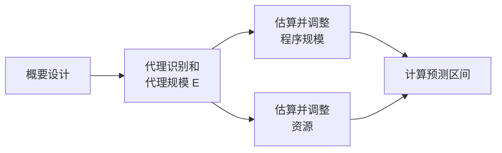
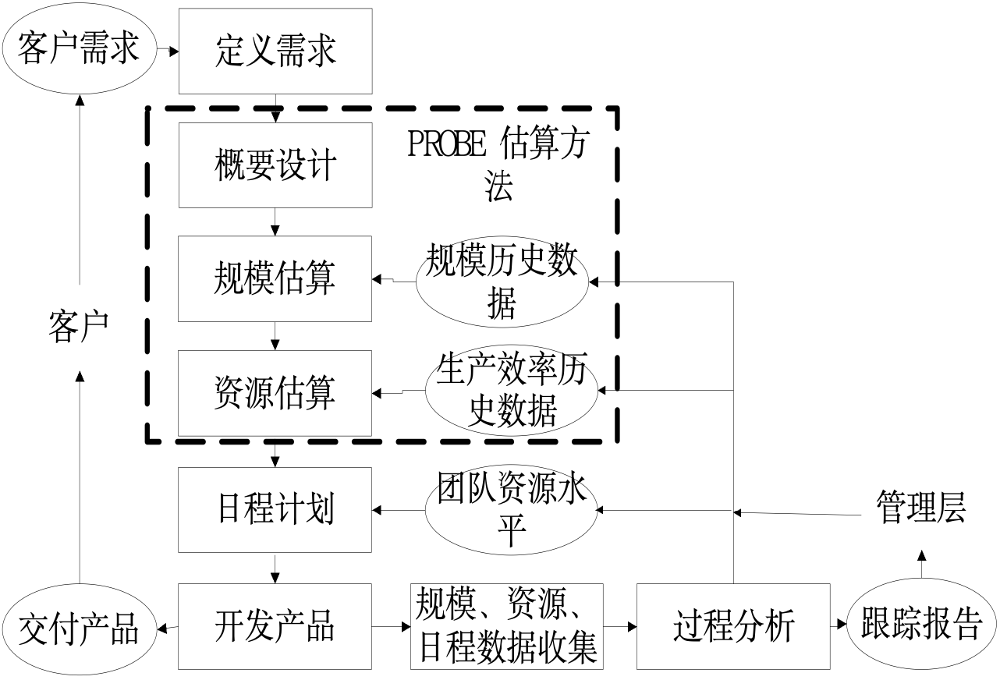
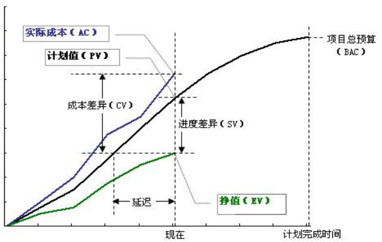
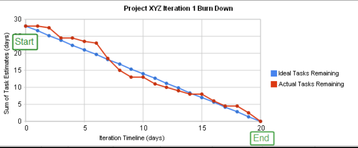
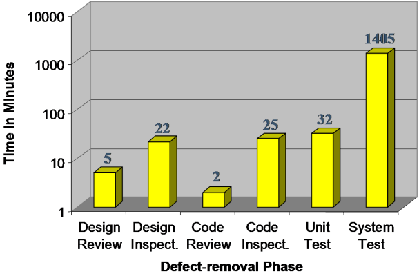
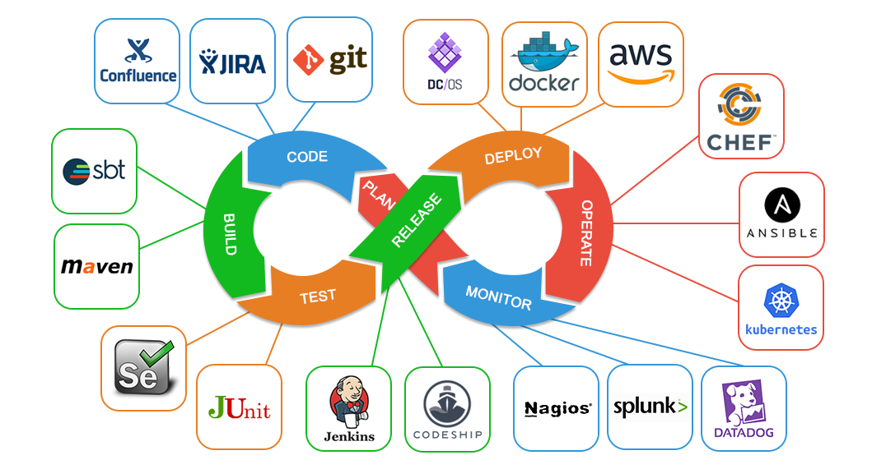
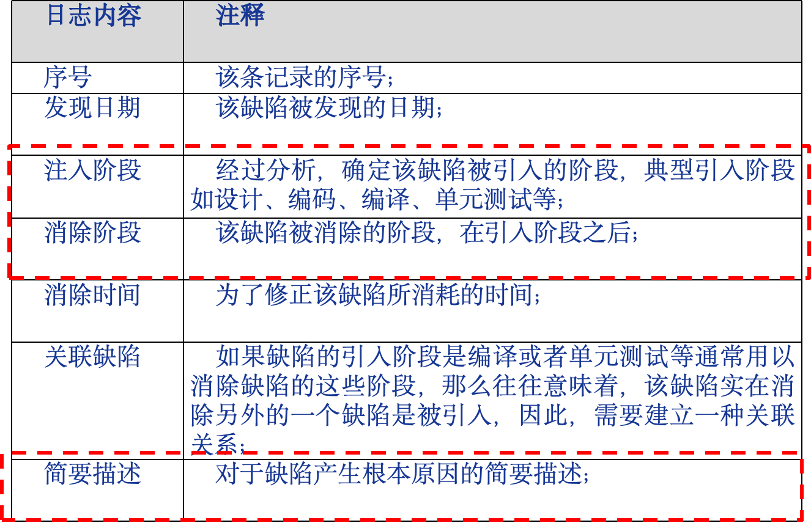

# 软件质量与管理 · 课程总结必背

> 《孙子兵法》：“凡战者，以正合，以奇胜”。
>
> 敏捷宣言中的右项都是“正合”，左项则是“奇胜”

<!-- -->

> 严格遵循 `assets/slides/课程总结.md` 结构组织——**过程线 → 项目管理线 → 质量管理线**，可直接背诵。

## 过程线

### 一、概念

#### 1.1 管理是什么

**管理三要素：目标、状态、纠偏。**

- **目标**：设定清晰可度量的目标
- **状态**：跟踪当前状态，了解与目标的差距
- **纠偏**：根据差距采取纠正措施

> 软件开发天然"熵增"：需求膨胀、沟通混乱、设计退化、缺陷累积。管理通过计划、跟踪、评审、配置管理、度量、过程改进让三要素形成闭环。

> **知识点出处**：`软件质量与管理.第一讲.pdf` Slide 8

#### 1.2 管理视角的软件工程

**软件危机**：落后的软件生产方式无法满足迅速增长的计算机软件需求。1960 年代，NATO 1968 会议正式提出「软件工程」概念。

**软件工程**：研究用工程化方法构建和维护有效的、实用的和高质量的软件的学科。

- **管理视角**：能否复制成功？
- **技术视角**：是否可以将问题解决得更好？

<u>**广义软件过程**（背）</u> = 技术 + 人员 + 狭义过程。同义词：软件开发方法、软件开发过程（如：净室 Cleanroom、极限编程 XP、SCRUM、Gate 方法）。

> **核心公理**：软件产品和服务的质量，很大程度上取决于生产和维护该软件或者服务的过程的质量。

> **知识点出处**：`软件质量与管理.第一讲.pdf` Slide 5, 9, 10

#### 1.3 软件过程 vs 生命周期模型

| | 生命周期模型 | 软件过程 |
|---|---|---|
| **定义** | 对软件过程的一种人为划分 | <u>为了实现一个或多个事先定义目标而建立的一组实践的集合，这组实践之间往往有一定的先后顺序，最为整体来实现一个或多个事先定义的目标（背）</u> |
| **粒度** | 粗粒度框架 | 包含具体活动、角色、工件、技术实践和管理实践 |
| **内容** | 通常不含技术实践 | 包含技术实践和管理实践 |

**典型生命周期模型**：瀑布模型、迭代式模型、增量模型、螺旋模型、原型法。

<u>**区别**（背）</u>

- 生命周期模型是对一个软件开发过程的**人为划分**
- 生命周期模型是软件开发过程的主框架，是对软件开发过程的一种**粗粒度划分**
- 生命周期模型往往**不包括技术实践**

> **知识点出处**：`软件质量与管理.第一讲.pdf` Slide 9, 11

#### 迭代式开发

把软件开发分成多个小周期，每轮都经历需求、设计、实现、验证。目标是**尽早获得反馈、逐步降低不确定性**。

- 大型软件系统的开发过程也是<u>一个逐步学习和交流的过程</u>，软件系统的交付不是一次完成，而是通过多个迭代周期逐步完成交付。
- 迭代式开发是**方法论族**，不是上世纪 90 年代才出现。

> **知识点出处**：`软件质量与管理.第二讲.pdf` Slide 17

#### <u>如何理解瀑布模型（背）</u>

- 瀑布模型**不是单一模型**，而是一系列模型，覆盖最简单的场景（过程元素少）到最复杂的场景（过程元素多）。
- 软件项目应该结合实际情况选择合适过程元素的瀑布模型，基本原则是项目面临的困难和挑战越多，选择的模型应该越复杂
- 软件项目团队往往低估了项目挑战，选择了过于简单的不实用的瀑布模型。
- 瀑布模型在软件成为独立产品阶段被广泛使用，成为重文档、慢节奏的过程。

> **知识点出处**：`软件质量与管理.第二讲.pdf` Slide 11-13

### 二、软件过程管理

<u>**软件过程管理**的目的（背）</u>：让软件过程在开发效率、质量等方面有着更好性能绩效。

#### 2.1 PDCA 与 IDEAL

**PDCA（戴明环）**：

| Plan（计划） | Do（执行） | Check（检查） | Act（处理） |
|---|---|---|---|
| 分析现状→分析原因→找主因→定措施 | 执行措施和计划 | 检查执行效果 | 成功经验标准化；未解决问题进入下一轮 |

**IDEAL**：**I**nitiating → **D**iagnosing → **E**stablishing → **A**cting → **L**everaging

- Initiating：启动改进
- Diagnosing：诊断当前状态
- Establishing：建立改进计划
- Acting：执行改进
- Leveraging：总结经验并推广

> ⚠️ PDCA / IDEAL 是**过程改进参考模型**，可以用于敏捷环境。**CMMI 是过程改进模型，不是软件过程模型**。

> **知识点出处**：`软件质量与管理.第一讲.pdf` Slide 13

#### 2.2 CMM / CMMI

<u>**CMMI 五级成熟度**（背）</u>：

| 等级 | 名称 | 核心特征 |
|---|---|---|
| 1 | Initial 原始级 | 混乱，依赖个人英雄主义，救火文化 |
| 2 | Managed 已管理级 | 项目层面有计划、跟踪、需求管理、配置管理 |
| 3 | Defined 已定义级 | 组织层面有标准过程，项目可裁剪 |
| 4 | Quantitatively Managed 定量管理级 | 统计过程控制（SPC）和预测模型 |
| 5 | Optimizing 优化级 | 持续识别偏差、根因并改进 |

**为什么 4/5 级是高等级**：

- 2/3 级关注**当前状态**——过程是否按计划执行。
- 4 级用统计过程控制和预测模型，能根据量化数据**预判未来**。
- 5 级主动识别偏差、找到根因并消除，实现**持续优化**。

**关键理解**：

- CMMI 是**过程改进模型**，不是软件过程模型。
- CMMI**不是过程优劣的标准**，不适合用作公司间能力比较。
- **CMMI 与敏捷不对立**（伪命题）——CMMI 是过程管理/改进模型，XP/Scrum 是开发方法或过程框架，二者性质不同。

> **知识点出处**：`软件质量与管理.第二讲.pdf` Slide 14-15

#### 2.3 软件过程管理 vs 软件项目管理

| | 软件项目管理 | 软件过程管理 |
|---|---|---|
| **关注** | 当前项目目标（成本、质量、工期） | 组织/团队的长期过程能力 |
| **管理对象** | 项目（Scrum、Kanban 等） | 过程（CMMI、SPICE 等） |
| **类比** | 产品生产管理 | 流水线的设计、维护和升级 |

二者相关但不等同。软件过程管理 ≈ 软件过程改进。

> **知识点出处**：`软件质量与管理.第一讲.pdf` Slide 12-13

### 三、软件工程演变的历史视角

#### 3.1 软件危机和软件工程

- **软件危机**：落后的软件生产方式无法满足迅速增长的软件需求。<u>1960 年代出现</u>，NATO 1968 会议正式提出「软件工程」。
- **软件工程**：用工程化方法构建和维护有效的、实用的和高质量的软件的学科。

> **知识点出处**：`软件质量与管理.第一讲.pdf` Slide 5

#### 3.2 三大阶段

| 阶段 | 时间 | <u>软件应用典型特征</u> | <u>软件开发典型特征</u> | <u>典型方法</u> |
|---|---|---|---|---|---|
| **软硬件一体化** | 50 年代~70 年代 | 软件依附硬件；功能单一；复杂度有限；几乎不需要需求变更；硬件太贵 | 硬件思维主导（"三思而后行"）；缺陷修复成本极高（硬件不可逆）；开发者多为数学/电子工程师；无专业软件工程角色 | "Measure twice, cut once"（代码评审）、Code and Fix、线性顺序过程（硬件开发） |
| **软件成为独立产品** | 70 年代~90 年代 | 摆脱硬件束缚（OS）；功能强大；规模和复杂度剧增；个人电脑出现→普通人成为软件用户→需求多变、兼容性要求；来自市场的压力 | 重文档、慢节奏、线性顺序；需求在前设计在后；强调可预测性和过程成熟度；出现专业软件工程角色和方法论 | 形式化方法、结构化程序设计、瀑布模型、成熟度运动 |
| **网络化和服务化** | 90 年代中期迄今 | 功能更复杂，规模更大；用户数量急剧增加；快速演化和需求不确定；分发方式变化（SaaS） | 快速迭代、持续交付；开发与运维融合（DevOps）；用户反馈驱动开发；小团队自主管理；AI/大数据/云支撑 | 迭代式开发、敏捷方法、开源开发、DevOps |

**当前时代特征**：

- 进一步服务化和网络化（移动是主流）；用户需求多样性进一步凸显
- 用户期望"**多快好省**"：多（功能丰富、个性化）、快（快速使用、及时更新）、好（稳定、可靠、安全、可信）、省（获得成本低，最好免费）
- 空前强大的开发和部署环境：XaaS（IaaS、PaaS、SaaS、FaaS）；盛行共享和开源；AI、大数据、云支撑

> **知识点出处**：`软件质量与管理.第二讲.pdf` Slide 3-25

#### 3.3 敏捷宣言

**2001 年，犹他州雪鸟滑雪场，17 位方法论专家签署。**

<u>**敏捷宣言四条**（背）</u>：

1. **个体和互动** 胜过 流程和工具
2. **可以工作的软件** 胜过 详尽的文档
3. **客户合作** 胜过 合同谈判
4. **响应变化** 胜过 遵循计划

> 尽管右项有其价值，但更重视左项的价值。

<u>**如何正确理解敏捷宣言**（背）</u>（已考 2020-mid、2022、2023 简答）：

1. **不是否定右项**：敏捷宣言并不是说流程和工具、文档、合同谈判、计划不重要，而是强调左项（个体互动、可工作软件、客户合作、响应变化）具有更高的优先级。
2. **"胜过"而非"替代"**：关键词是"胜过"（over），而非"替代"。敏捷团队仍然需要流程、文档、合同和计划，只是这些不应该是核心关注点。
3. **价值观导向**：敏捷宣言是价值观层面的宣言，不是具体的操作方法。它指导团队在各种决策中做出符合敏捷精神的选择。
4. **实践服务于价值观**：具体的敏捷实践（如 Scrum、XP 等）都是为了实现这些价值观而设计的，不应本末倒置地将实践本身当作目标。
5. **与规范方法的关系**：计划驱动的开发人员必须敏捷，敏捷开发人员必须规范。敏捷和规范不是对立的两极，而是软件开发中需要平衡的两个维度。

**敏捷方法核心特征**：

- 敏捷方法是**适应性而非预见性**的、**面向人而非面向过程**的
- 工程方法（计划驱动）借鉴**土木工程**思路，将"设计与建造分离"
- 敏捷从价值观→原则→实践形成三层体系，价值观是最根本层次

**敏捷项目成功观**：

- **预测型**：成功 = 按时按预算完成
- **敏捷型**：成功 = 为客户创造价值。好的敏捷项目可能做出与原计划不同但更好的产品。

> ⚠️ 不要误解敏捷："轻量级""不计划""不严格"都容易误导。优秀敏捷方法也很严格；所有正式项目都需要计划。计划驱动与敏捷**不是绝对反义词**。

**典型敏捷方法**：

| 方法 | 侧重点 |
|---|---|
| **XP（极限编程）** | 偏重工程实践（TDD、结对编程、CI、重构） |
| **Scrum** | 管理框架和管理实践 |
| **Kanban** | 精益生产的具体实现——可视化工作流、限定 WIP、管理周期时间 |

**开源软件开发**：

- **Linus 定律**："如果有足够多的 beta 测试者和合作开发者，几乎所有问题都会很快显现，然后自然有人会把它解决。"
- 核心实践："早发布，常发布，倾听用户反馈"；"把用户当成开发合作者"
- 设计理念："设计上的完美不是没有东西可以再加，而是没有东西可以再减"
- 演化形式：内部开源（Inner Source）、众包（Crowdsourcing）

<u>**DevOps 典型方法**（背）</u>：

- 方法论基础：敏捷软件开发、精益思想以及看板 Kanban 方法
- 以领域驱动设计为指导的微服务架构
- 大量虚拟化技术的使用
- 一切皆服务（XaaS）的理念指导
- 构建了强大的工具链，支持高水平自动化

> **知识点出处**：`软件质量与管理.第二讲.pdf` Slide 18-20, 25；`8敏捷概述.pdf`

#### 3.4 驱动力：四大本质困难

**Brooks《没有银弹》提出四大本质困难**：

1. **复杂性（Complexity）**
2. **不可见性（Invisibility）**
3. **可变性（Changeability）**
4. **一致性（Conformity）**

- 根植于软件特性，不会被工具或语言进步彻底消除。
- 三个本质难题因项目而异；四大本质难题相互促进。
- **本质难题的变化带动软件方法（过程）的演变**。
- ⚠️ "质量挑战"不是本质困难。
- **不可见性**与软件发展阶段没有直接关系。

> **知识点出处**：`软件质量与管理.第二讲.pdf` Slide 2

## 项目管理线

### 四、概念

#### 4.1 三大目标

软件项目管理的**三大典型目标**：<u>**成本、质量、工期**（背）</u>。

<u>软件项目管理定义（背）</u>：应用**方法**、**工具**、**技术**以及**人员能力**来完成软件项目，实现项目目标的过程。

软件项目管理包含：估算、计划、跟踪、风险管理、范围管理、人员管理、沟通管理。

> **知识点出处**：`软件质量与管理.第一讲.pdf` Slide 8

### 五、团队动力学

#### 5.1 <u>软件开发是知识工作特点</u>

- 软件开发是**既复杂又富有创造性的知识工作**。
- 软件开发是**智力劳动**
- 要求工程师必须**全身心参与工作**，**主观意愿上努力追求卓越**
- 知识工作者是**智力劳动者**
- 要求管理者**激励**并**维持激励**

> **知识点出处**：`软件质量与管理.第三讲.pdf` Slide 2

#### 5.2 知识工作管理

**关键规则**：管理者无法管理知识工作者，知识工作者必须实现并且学会**自我管理**。

**知识工作者自我管理的要求**：

1. 有积极性
2. 能做出准确的估算和计划
3. 懂得协商承诺
4. 有效跟踪他们的计划
5. 持续地按计划交付高质量产物

**胶冻状团队（Jelled Team）**（DeMarco & Lister《人件》）：
"团队中到处蔓延着一些神奇的东西，体现着独特的伦理、态度和力量。团队成员相互支持，凭直觉就知道何时以及如何帮助彼此。每一个团队成员都深深感觉到是共同力量的一部分，有一种强烈的归属感和互助友爱的感觉。"

> **知识点出处**：`软件质量与管理.第三讲.pdf` Slide 3-4

#### 5.3 领导者和特点

**知识工作者的管理需要的是领导者，而不是经理。**

**经理 vs 领导者对比**：

| 角色经理 | <u>**团队领导者**</u> |
|---|---|
| 告知（Tell） | 倾听（Listen） |
| 指导（Direct） | 询问（Ask） |
| 说服（Persuade） | 激励/挑战（Inspire/Challenge） |
| 决定（Decide） | 促进达成一致（Facilitate consensus） |
| 控制（Control） | 教练（Coach） |
| 监控（Monitor） | 授权（Empower） |
| 设定目标（Set goals） | 挑战（Challenge） |

**三种领导方式**：威逼 → 利诱（交易型）→ **鼓励承诺（转变型）** —— 知识工作首选。

- **交易型领导方式**：承诺奖励激励（威逼和利诱属于此类）。人们通常能找到新的方式来获得奖励，同时少做工作。
- **转变型领导方式**：用成就激励。鼓励承诺属于转变型领导方式。由于交易型领导方式很少能产生成功的并且有创造性的团队，因此转变型领导方式是首选。

**承诺的四项保证**：

1. 承诺是**自愿**的
2. 承诺是**公开**的
3. 承诺是**可信（行）**的
4. 向**团队**承诺（团队承诺比个人承诺激励作用更大）

<u>**知识工作领导者的四个品质**（背）</u>（已考 2024Spring）：

| 品质 | English | 含义 |
|---|---|---|
| **诚实** | Honest | 信守承诺，言行一致 —— "did what they said they would do"。让团队成员感到信任和尊重。
| **能力** | Competent | 展现出卓越的**技能和知识** —— "skills and knowledge"。知识工作团队的领导者需要让成员信服其专业判断。 |
| **远见** | Visionary | 能够超越眼前的挑战和任务，具备明确和可信的未来愿景 —— "can they see past the horizon, do they have a believable view of a desirable future?" |
| **激励** | Inspirational | 传播积极、充满热情和能量的未来愿景 —— "do they have a positive, enthusiastic, and energetic view of the future?" |

> **知识点出处**：`软件质量与管理.第三讲.pdf` Slide 5-6, 9-11, 34

#### 5.4 不同的激励方式

#### <u>马斯洛需求层次理论（五层）（背）</u>

1. **生理需求** → 2. **安全需求** → 3. **社交/归属需求** → 4. **尊重需求（Esteem）** → 5. **自我实现（Self-actualization）**

关键记忆点：

- 自我实现是最高层次。⚠️ 自我实现 ≠ 自尊（第 5 层 ≠ 第 4 层）。
- 激励来自为没有满足的需求而努力奋斗。
- 低层次的需求必须在高层次需求满足之前得到充分满足。
- 满足高层次需求的途径比满足低层次的途径更为广泛。
- 晚年修正：高层次需求不一定要等低层次完全满足后才出现。

> **知识点出处**：`软件质量与管理.第三讲.pdf` Slide 7-8

#### <u>期望理论</u>

```
Motivation = Valence × Expectancy
```

- **Valence（价值感）**：成功结果的吸引力
- **Expectancy（期望）**：相信努力很可能产生成功的结果

关键理解：

- 过于宏大的目标提高价值感（V↑）但降低可达成预期（E↓），反而削弱动力。
- "构建高质量软件"太抽象，应拆成可执行、可跟踪的里程碑。
- 提升成功把握的两种方式："现实扭曲立场"和"**数据!!!**"

> **知识点出处**：`软件质量与管理.第三讲.pdf` Slide 17-18

#### 其他激励理论

**Herzberg 双因素理论**：

| 激励因素（内在因素） | 保健因素（外在因素） |
|---|---|
| 成就感、责任感、晋升、被赏识、认可 | 工作环境、薪金、工作关系、安全 |

- 激励因素使人满意，保健因素防止不满意。

**McGregor X/Y 理论**：

| X 理论 | Y 理论 |
|---|---|
| 不喜欢工作并努力逃避 | 如果给予适当的激励，会达到很高的绩效预期 |
| 缺乏进取心，没有解决问题与创造的能力 | 具有创造力，想象力，雄心和信心 |
| 更喜欢经常的指导，避免承担责任 | 能够自我约束，自我导向与控制，渴望承担责任 |
| 用马斯洛底层需求（生理和安全）激励 | 用马斯洛高层需求（自尊和自我实现）激励 |

> **知识点出处**：`软件质量与管理.第三讲.pdf` Slide 13-16

#### 5.5 自主团队

<u>**自主团队六大特征**（背）</u>：

1. 自行定义项目的目标
2. 自行决定团队组成形式以及成员的角色
3. 自行决定项目的开发策略
4. 自行定义项目的开发过程
5. 自行制定项目的开发计划
6. 自行度量、管理和控制项目工作

**自主团队的外部环境（启动阶段）**——6 条获得管理层支持的措施：

1. 体现满足管理层需求的意愿
2. 定期报告项目状态
3. 证明计划是合理的
4. 追求高质量
5. 允许变更
6. 寻求帮助

**自主团队的外部环境（进展阶段）**——5 条措施：

1. 严格遵循过程
2. 维护个人和团队计划
3. 管理产品质量
4. 跟踪进展并定期汇报
5. 持续展现优异表现

> **知识点出处**：`软件质量与管理.第三讲.pdf` Slide 19-21

#### 5.6 TSP 角色和职责

**TSP 三大组成部分**：PSP（个人技能培养）→ TSP 团队组建过程 → TSP 团队工作过程。

<u>**TSP 六大角色**（背）</u>（典型 7 个角色，含开发人员）：

| 角色 | 核心职责 |
|---|---|
| **项目组长**（Team Leader） | 建设和维持高效团队；激励成员；主持会议；汇报状态；合理处理团队成员问题 |
| **计划经理**（Planning Manager） | 开发团队和个人计划；平衡计划；跟踪进度 |
| **开发经理**（Development Manager） | 制定开发策略；规模和资源估算；需求规格说明；高层设计；实现与测试 |
| **质量经理**（Quality Manager） | 制定和跟踪质量计划；警示质量问题；组织评审；在提交配置管理前评审消除质量问题 |
| **过程经理**（Process Manager） | 维护过程数据、<u>开发标准</u>、会议记录；支持过程改进 |
| **支持经理**（Support Manager） | 保证工具环境；配置管理；维护风险/问题跟踪系统；支持复用策略 |
| **开发人员**（Developer） | 按计划完成开发任务 |

#### TSP 启动过程（TSP Launch）

<u>**TSP Launch 9 次会议**（背）</u>：

| 会议 | 内容 | 关键问题 |
|---|---|---|
| 1 | 建立产品目标和业务目标 | 要做什么？要做得怎么样？ |
| 2 | 角色分配和小组目标定义 | 怎么安排？有没有与组织目标冲突？ |
| 3 | **开发流程定义与策略选择** | 使用什么样的过程？分为几个迭代？每个迭代做什么？组件如何获取？ |
| 4 | 整体计划 | 估算+计划，明确做哪些事情？产出物？规模？需要多少资源？ |
| 5 | 质量计划 | 有哪些质量实践？做到什么程度？需要投入多少资源？ |
| 6 | 个人计划以及计划平衡 | 个人要做哪些事情？如何寻求最早完成项目的时间？ |
| 7 | 风险评估 | What if？ |
| 8 | 准备向管理层汇报计划 | 呼应第一次会议要求，体现团队述求，体现计划不是粗制滥造 |
| 9 | 向管理层汇报计划和讨论 | 汇报并讨论 |

**第 10 次会议**：总结得失（在汇报之后）。

> ⚠️ 会议 3 "确定开发策略"常考，是 Launch 的关键步骤。

> **知识点出处**：`软件质量与管理.第三讲.pdf` Slide 22-32

#### 5.7 Scrum 角色和职责

#### 核心记忆：<u>Scrum 33355（背）</u>

- **3 角色**：Product Owner、Scrum Master、Developers
- **3 工件**：Product Backlog、Sprint Backlog、Increment
- **3 支柱**：透明（Transparency）、检视（Inspection）、适应（Adaptation）
- **5 事件**：Sprint、Sprint Planning、Daily Scrum、Sprint Review、Sprint Retrospective
- **5 价值观**：承诺（Commitment）、专注（Focus）、开放（Openness）、尊重（Respect）、勇气（Courage）

#### 关键数字

- 术语来源：竹内弘高与野中郁次郎，**1986** 年「The New New Product Development Game」
- Scrum Team 通常 **10 人或更少**
- Daily Scrum 时间盒：**15 分钟**
- Sprint 周期：约 **2 周**，最长不超过一个月
- 理论基础：**经验主义与精益思维**

#### 角色职责

**Product Owner（PO）**：

- 对产品价值最大化负责
- 管理 Product Backlog（内容、排序、透明度）
- **排序权归 PO**，以最好地实现目标和使命
- 优化开发工作的价值
- 确保 PBI 可见、透明、清晰
- 确保开发团队对 PBI 有足够深的了解

**Scrum Master**：

- 保证 Scrum 被正确理解和使用
- 是**服务型领导**（Servant Leader）
- 服务于 PO：确保目标、范围、产品域清晰；帮助理解经验主义环境中的产品规划
- 服务于开发团队：作为教练指导自组织和跨职能；移除工作进展中的障碍
- 服务于组织：带领组织采纳 Scrum；引发提升团队生产率的改变

**Developers**：

- 每个 Sprint 创建可用 Increment
- **自组织**的——没有人有权告诉团队如何把 PBI 变成功能增量
- **跨职能**的——团队整体拥有全部所需技能
- Scrum 不认可任何头衔（都叫开发人员）
- Scrum 不认可"子团队"（无论测试、架构、运维等）
- 成员可能有专长，但**责任属于整个开发团队**

#### 用户故事与 Product Backlog

**用户故事模板**：`作为<某类用户>，我想<做某事>，从而<获得某种价值>` → who / what / why

**3C**：**C**ard（卡片）、**C**onversation（交谈）、**C**onfirmation（确认）

**INVEST**：**I**ndependent（独立）、**N**egotiable（可协商）、**V**aluable（有价值）、**E**stimable（可估算）、**S**mall（小而适当）、**T**estable（可测试）

#### 猪与鸡

- **猪**（全身投入）：PO、SM、Developers
- **鸡**（参与但不决策）：用户、客户、经理等

#### DoD（Definition of Done）

团队对"完成"的统一定义，判断增量是否真正可交付。DoD 确保透明度——只有符合 DoD 的 PBI 才算完成。

#### 大规模敏捷

**SAFe**：团队层 → 项目群层（ART）→ 解决方案层 → 组合层。争议："披着敏捷外衣的瀑布"。

**LeSS**：基本 LeSS（2-8 团队）、LeSS Huge（8+ 团队）。一个 PO、共享 Backlog、同一 Sprint。

> **知识点出处**：`软件质量与管理.第三讲.pdf` Slide 53-60；`Scrum.pdf`

### 六、估算和计划

#### 6.1 估算要点

#### 估算目的是什么？

- 支撑管理决策
- 理解范围和复杂度
- 提供资源/工期依据
- 建立跟踪基线

**核心观点**：**估算要的是过程，而非结果**——估算过程是干系人达成共识的过程。

**估算本质上是一种猜测**，目标是提高**一致性和可信度**。

#### 抽象的、相对的估算

- 软件的特征和功能是抽象的，没有统一的物理度量标准
- **规模估算更适合利用历史数据**（偏差原因相对客观）
- 时间估算受主观能动性影响，历史时间数据不一定可靠
- 估算的核心是**比较**——A 比 B 大多少，而非绝对大小

<u>**规模估算的基本要点**（背）</u>

- 尽可能划分详细一些
- 建立对结果的信心
- 依赖数据
- 估算要的是过程，而非结果；估算的过程是相关干系人达成一致共识的过程

#### 6.2 PROBE 估算方法

**PROBE** = **PRO**xy **B**ased **E**stimation（基于代理的估算）

<u>**PROBE估算的基本思想**（背）</u>：

- 用代理规模连接早期规划需要和后期精确度量
- 估算相对大小，而非绝对大小
- 依赖高质量历史数据和一致过程

<u>**PROBE估算流程**（背）</u>：



**为什么不用历史生产效率数据**：

- 生产效率在分母上，个体软件工程师生产效率波动大
- 直接用历史生产率倒推会**放大估算偏差**
- 所以用代理规模→规模的回归代替

<u>**优点**</u>：过程清楚，可积累数据，可用统计方法调整。

<u>**缺点**</u>：高度依赖历史数据质量，数据缺失或不稳定时偏差显著。

> **知识点出处**：`软件质量与管理.第四讲.pdf`

#### 6.3 Scrum 故事点

**故事点（Story Point）**：Scrum 中用于估算 PBI(Product Backlog Item) 相对大小的单位。

- 故事点是**相对的、抽象的**度量，不是时间单位
- 典型序列：斐波那契数列（1, 2, 3, 5, 8, 13, 21...）或 T恤尺码（S, M, L, XL）
- **Planning Poker（计划扑克）**：团队成员同时出牌，讨论差异，达成共识
- 通过 Velocity（每个 Sprint 完成的故事点数）将故事点与时间关联
- Velocity 是**观察值**而非承诺值，随团队成熟度变化

> **知识点出处**：`Scrum.pdf`；`软件质量与管理.第四讲.pdf`

#### 6.4 通用计划框架



<u>**通用计划框架计划链路**（背）</u>：

1. 定义需求
2. 概要设计
3. 规模估算
4. 资源估算
5. 日程计划
6. 开发产品
7. 收集规模、资源、日程数据
8. 过程分析

<!-- -->

- **正推**（从需求推导日程），不是从截止日期倒推
- 需求定义和概要设计需**人工判断**
- 规模和资源估算借助历史数据和模型

#### WBS（工作分解结构）

**作用**：范围基线、提供整体视图、不遗漏可交付物、明确角色职责、定义工作包、为估算与计划提供基础、理解工作与分析风险。

**创建方法**：识别可交付成果 → 确定分解结构 → 自上而下分解 → 分配编码 → 核实充分性。

**良好 WBS 检查标准**：

- 元素唯一（不重复）、定义清晰完整、责任人明确
- 范围完整——**WBS 最底层要素是实现目标的充分必要条件**
- WBS 分解时同一层**不能**应用不同标准（保持一致的分解维度）

> ⚠️ **WBS 不一定对应 OBS**（组织分解结构），二者关注角度和目的不同。

> **知识点出处**：`软件质量与管理.第四讲.pdf` Slide 24-28

#### 6.5 各类计划

#### 质量计划

质量计划定义：

- 有哪些质量实践？
- 做到什么程度？
- 需要投入多少资源？

质量计划关键内容：评审计划、测试计划、缺陷管理计划、质量标准（DoD）。

#### 风险计划

**风险管理过程**：风险识别 → 风险分析 → 风险应对规划 → 风险跟踪与控制

<u>**四大风险应对策略**（背）</u>：

| 策略 | 含义 |
|---|---|
| **规避** | 改变计划以消除风险 |
| **转移** | 将风险影响和责任转移给第三方 |
| **缓解** | 降低风险发生概率或减少影响 |
| **接受** | 不主动改变计划，准备发生时处理 |

> **知识点出处**：`软件质量与管理.第四讲.pdf`

#### 6.6 定量管理计划（自顶向下）

**过程模型（Process Model）**：

- 描述过程的输入、输出、活动及其关系
- 识别关键子过程及其性能属性

**过程能力基线（Process Capability Baseline, PCB）**：

- 基于历史数据建立过程性能的统计分布
- 提供过程的"正常范围"（均值 ± 控制限）

<u>**关键子过程性能基线（Process Performance Baseline, PPB）**</u>：

- 针对**每个关键子过程**建立各自的性能基线（如：设计评审缺陷发现率、代码评审缺陷发现率、单元测试缺陷发现率等各自的历史统计分布）
- 与 PCB 的关系：PCB 是**整体过程**的能力基线，PPB 是其构成成分——每个关键子过程一个 PPB

**关键子过程性能模型（Process Performance Model, PPM）**：

- 描述关键子过程性能属性之间的**预测关系**（如：设计评审质量 → 代码质量 → 测试缺陷密度之间的定量关系）
- 用于预测：在一定子过程性能条件下，最终质量指标的大致范围

**过程组合**：

- **关键子过程性能目标**：每个关键子过程的量化目标（如：代码评审缺陷发现率 ≥ 0.8/h）
- **整体过程性能目标**：由关键子过程目标汇总而成的整体目标（如：总缺陷消除率 ≥ 95%）

核心思想：通过**统计过程控制（SPC）**管理子过程的稳定性，确保整体过程的可预测性。

> **知识点出处**：`软件质量与管理.第四讲.pdf`——定量管理

### 七、跟踪

#### 7.1 挣值管理体系（EVM）



**核心变量**：

| 变量 | 英文 | 含义 |
|---|---|---|
| PV | Planned Value | 计划价值（到当前时间点计划完成的工作价值） |
| EV | Earned Value | 挣值（实际完成的工作价值） |
| AC | Actual Cost | 实际成本（实际花费） |
| BAC | Budget at Completion | 完工预算（项目总预算） |

**常用公式**：

```
SV = EV - PV          （进度偏差，>0 超前）
SPI = EV / PV         （进度绩效指数，>1 超前）
CV = EV - AC          （成本偏差，>0 节约）
CPI = EV / AC         （成本绩效指数，>1 节约）
EAC = AC + (BAC - EV)/CPI
EAC = BAC / CPI
```

<u>**三种实现层次**（背）</u>：

| 层次 | 信息 | 能回答的问题 |
|---|---|---|
| **简单** | EV + PV | 完成了多少有价值的工作？ |
| **中级** | + SV + SPI | 进度超前还是落后？⚠️ **不引入成本信息** |
| **高级** | + AC + BAC + EAC | 成本节约还是超支？预计完工成本？ |

⚠️ **中级实现不引入成本信息，成本信息属于高级实现。** EV 强调**完成任务才获得价值**，比只看工时更能反映真实进展。

#### 变形：燃尽图



- <u>燃尽图（Burndown Chart）是 EVM 在敏捷项目中的简化变形（背）</u>
- 横轴为时间（Sprint 天数），纵轴为剩余工作量（故事点/任务数）
- 对比理想燃尽线与实际剩余工作量，直观展示进度偏差
- 燃尽图本质上是 EVM 的可视化简化

#### <u>挣值管理为何适应软件项目（背）</u>

- 软件工作的价值难以直接度量，EVM 通过**完成百分比**间接度量
- EVM 将进度和成本用统一的"价值"单位衡量
- 适合**分解清晰（WBS）**的项目管理场景
- EV 概念强调交付价值而非消耗时间，符合软件项目管理本质

> **知识点出处**：`软件质量与管理.第四讲.pdf`——挣值管理

#### 7.2 定量管理的跟踪（自顶向下）

**关键子过程性能控制**：

- 对每个关键子过程建立**控制图（Control Chart）**
- 监控子过程是否处于**统计受控状态**
- **控制限（UCL/LCL）**不是规格限（Specification Limits）

**异常判定规则**：

1. 任一点超出控制限（3σ）
2. 连续 7 点在中心线同一侧
3. 连续 7 点上升或下降
4. 其他非随机模式

**异常处理流程**：

```
识别失控信号 → 停止 -> 分析根因 → 纠正措施 → 验证改进 → 继续
```

> **知识点出处**：`软件质量与管理.第四讲.pdf`——定量跟踪

## 质量管理线

### 八、概念

#### 8.1 质量管理的挑战：三要素

质量管理面临与管理三要素对应的三大挑战：

| 要素 | 挑战 |
|---|---|
| **目标** | 质量目标不容易被单一指标完整表达，不同用户优先级不同 |
| **状态** | 质量状态不完全可见（缺陷、可维护性隐藏在代码内部） |
| **纠偏** | 越晚纠偏成本越高，需把评审、测试、度量前移 |

> **知识点出处**：`软件质量与管理.第五讲.pdf`

#### 8.2 面向用户的质量观

<u>**用户质量观 = 满足用户需求的程度**（背）</u>，最终从用户价值和满意度判断。

**答题四问**：

1. 用户是谁？
2. 用户需求的优先级是什么？
3. 这种优先级会怎样影响开发过程？
4. 怎样度量这种质量观下的质量水平？

**质量定义的经典表述**：

| 专家/标准 | 质量定义 |
|---|---|
| **ANSI/IEEE Std 729** | 软件质量是与软件产品满足规定和隐含需求的能力相关的全部特征和特性 |
| **《代码大全》** | 质量 = 外部质量（面向最终用户）+ 内部质量（不直接面向用户） |
| **Tom DeMarco** | 质量 = 使世界更美好；用户满意度最重要 |
| **Gerald Weinberg** | 质量 = 对人的价值（主观的） |

**典型用户质量期望**：必须能工作、较快执行速度、安全性、保密性、可用性、可靠性、兼容性、可维护性、可移植性。

**质量管理大师**：

| 人物 | 核心贡献 |
|---|---|
| **Deming** | PDCA 循环（戴明环），日本质量管理之父。质量应由过程构建出来。 |
| **Juran** | 质量三部曲（计划、控制、改进），适用性质量，80/20 原则。 |
| **Crosby** | 零缺陷思想，质量 = 符合要求，质量来自预防。 |
| **Humphrey** | 软件过程之父，CMM → PSP → TSP，将统计质量控制引入软件工程。 |

> **知识点出处**：`软件质量与管理.第五讲.pdf` Slide 2-6

#### 8.3 质量管理策略和背后逻辑

**核心思想**：用**缺陷管理替代抽象的质量管理**；尽早通过高质量评审消除缺陷。

**关键逻辑**：

- 缺陷存在越久，消除成本越高
- 代码评审/设计评审通常比后期测试更高效
- 测试不能被取消，但应尽量让缺陷在上游阶段被发现
- **测试发现缺陷多 = 前期质量差**，不应把"测出很多 bug"当作质量好

**评审 vs 测试的缺陷消除代价（行业数据）**：

| 来源 | 评审代价 | 测试代价（相对评审） |
|---|---|---|
| IBM | 1x | 4.1x |
| JPL | $90-120/缺陷 | $10,000/缺陷 |
| Russell | 1 小时 | 2-4 小时（测试）/ 33 小时（应用中发现） |
| Weller | 0.7 小时 | 6 小时 |
| Ackerman | 1 小时 | 2-20 小时 |
| Shooman | 0.6 小时 | 3.05 小时 |

**对比原因**：评审直接按评审者逻辑发现缺陷（同时知道位置和原因），测试需要发现异常→理解程序→调试定位→确定修复方案→回归测试的多步流程。

**Boehm 缺陷修复成本曲线**（1981）：

```
需求 1x → 设计 5x → 编码 10x → 测试 20x → 上线 100x
```

> **知识点出处**：`软件质量与管理.第五讲.pdf`

### 九、评审

#### 9.1 个人评审

#### 定义与时机

**个人评审**：工程师在编译和单元测试**之前**，依据检查表独立阅读**自己的代码**。

**时机选择**：在编译、单元测试**之前**发现缺陷。

#### 关键控制因素

- <u>**评审速度（Review Rate）**（背）</u>：
  - 代码评审：不超过 **200 LOC/小时**
  - 文档评审：不超过 **4 页/小时**
- **检查表**：应**个性化**、**定期更新**
- 个人评审不能被小组评审替代

> **知识点出处**：`软件质量与管理.第五讲.pdf`——个人评审

#### 9.2 小组评审

**小组评审适合发现**：

- 理解偏差
- 接口不一致
- 设计缺陷

**过程质量控制方式**：

- 小组评审是软件开发中重要的质量控制手段
- 与个人评审互补：个人评审发现局部缺陷，小组评审发现全局/理解性缺陷
- 小组评审应形成评审报告

> **知识点出处**：`软件质量与管理.第五讲.pdf`——小组评审

### 十、质量控制指标



#### 10.1 Yield（缺陷消除率）

- **Phase Yield**：某一阶段消除缺陷的比例 = 该阶段发现的缺陷数 / 进入该阶段的缺陷总数
- **Process Yield**：过程整体消除缺陷的比例 = 过程发现的总缺陷数 / 注入的总缺陷数

**Yield 的用途**：

- 评估各阶段评审/测试的有效性
- 可建立 Yield 预测模型，预测发布后的缺陷数
- 支持过程改进——识别缺陷消除薄弱环节

基于Yield的缺陷预测模型：

- 利用历史数据估计缺陷注入率和缺陷消除率。
- 输入包括规模、文档规模、人员规模、各阶段缺陷注入/消除密度和速度。
- 可用回归技术建模，并在项目进行中用实际数据反馈修正。
- 改进方案：引入更多影响因子，维护高质量历史数据，假设分布后用蒙特卡罗模拟。

> **知识点出处**：`软件质量与管理.第五讲.pdf`——Yield

#### 10.2 <u>A/FR（质检失效比）（背）</u>

```
A/FR = PSP 质检成本 / PSP 失效成本
     = (设计评审时间 + 代码评审时间) / (编译时间 + 单元测试时间)
```

- PSP 期望值约为 **2.0**
- **A/FR 过低**（< 1.0）：评审投入不足，缺陷大量漏到测试阶段
- **A/FR 过高**（> 3.0）：可能评审过度，效率下降
- A/FR 体现了"质量前移"的理念——评审比测试更高效

> **知识点出处**：`软件质量与管理.第五讲.pdf`——A/FR

#### 10.3 PQI（过程质量指标）

<u>**PQI五个因子**（背）</u>（每个 0~1，越接近 1 越好）：

1. **设计质量**：设计时间应 > 编码时间
2. **设计评审质量**：设计评审时间应 > 设计时间的 50%
3. **代码评审质量**：代码评审时间应 > 编码时间的 50%
4. **代码质量**：编译缺陷密度应当小于10个/千行
5. **程序质量**：单元测试缺陷密度应当小于5个/千行

- 设计质量 $\min\{1, \frac{设计时间}{编码时间}\}$
- 设计评审质量 $\min\{1, \frac{2\times 设计评审时间}{设计时间}\}$
- 代码评审质量 $\min\{1, \frac{2\times 代码评审时间}{编码时间}\}$
- 程序质量 $\min\{1, \frac{20}{10+编译缺陷/千行}\}$
- 程序质量 $\min\{1, \frac{10}{5+单元测试缺陷/千行}\}$

```
PQI = 设计质量 × 设计评审质量 × 代码评审质量 × 代码质量 × 程序质量
```

<u>**PQI 五因子的本质差异**（背）</u>：

- **前三者（设计质量、设计评审质量、代码评审质量）**：属于**过程度量/指标**——在过程进行中可主动干预和调整（如增加设计时间、增加评审投入）。
- **后两者（代码质量、程序质量）**：属于**结果度量/指标**——反映过程执行后的最终产出，不可直接干预，仅起 **confirm（验证/确认）** 作用。

<u>**PQI 的作用**（背）</u>：

- 判断模块开发质量
- 指导质量计划
- 为过程改进提供线索

⚠️ PQI 越接近 1 越好，五个分指标不能超过 1.0。

> **知识点出处**：`软件质量与管理.第五讲.pdf`——PQI

#### 10.4 DRL（缺陷消除效率比）

```
DRL = 某阶段每小时发现缺陷数 / 单元测试每小时发现缺陷数
```

⚠️ 以**单元测试每小时发现缺陷率**作为基准（不是缺陷个数）。

**用途**：比较不同缺陷消除活动的相对效率。DRL > 1 表示该活动比单元测试更高效地发现缺陷。

> **知识点出处**：`软件质量与管理.第五讲.pdf`——DRL

#### 10.5 特点和用途汇总

| 指标 | 核心公式 | 主要用途 | 关键记忆点 |
|---|---|---|---|
| **Yield** | 阶段消除缺陷 / 进入缺陷 | 评估阶段有效性、建立预测模型 | Phase Yield vs Process Yield |
| **A/FR** | 质检成本 / 失效成本 | 评估评审投入充分性 | ≈ 2.0 最佳 |
| **PQI** | 五因子乘积 | 综合评估过程质量 | 越接近 1 越好 |
| **DRL** | 某阶段发现率 / 单元测试发现率 | 比较消除活动效率 | 以单元测试为基准 |

**PSP 三个基本度量元**：**规模（Size）、时间（Time）、缺陷（Defect）**。⚠️ "风险"不是 PSP 基本度量元。

**GQM**：**G**oal → **Q**uestion → **M**etric。先明确目标，再提出问题，最后定义度量元。

> **知识点出处**：`软件质量与管理.第五讲.pdf`——指标汇总

### 十一、Quality Journey

#### 11.1 Quality Journey 是什么

追求极高质量的手段

<u>**Quality Journey（质量路径）顺序**（背）</u>：

1. 各种测试
2. 进入测试之前的产物质量提升
3. 评审过程度量和稳定
4. 质量意识和主人翁态度
5. 个体review的度量和稳定
6. 诉诸设计
7. 缺陷预防
8. 用户质量观——其他质量属性

**体现的质量管理哲学**：

- 先把**可见的质量活动**（测试）稳定，再逐步**前移**到评审、设计和预防
- 从**被动发现缺陷 → 主动预防缺陷**
- 是一个从"下游补救"向"上游预防"的渐进进化过程
- 每一步建立在前一步的基础上，不能跳跃

> **知识点出处**：`软件质量与管理.第五讲.pdf`——Quality Journey

#### 11.2 设计模板：要设计哪些信息？

**设计内容矩阵**：

| | 动态信息 | 静态信息 |
|---|---|---|
| **外部信息** | 交互信息（服务、消息等） | 功能（继承、类结构等） |
| **内部信息** | 行为信息（状态机） | 结构信息（属性、业务逻辑等） |

<u>**PSP 四大设计模板**（背）</u>：

| 模板 | 全称 | 描述对象 | 覆盖维度 | 记忆点 |
|---|---|---|---|---|
| **OST** | Operational Specification Template 操作规格模板 | 操作场景、外部交互、正常/异常使用 | 外部 + 动态 | **外部行为** |
| **FST** | Functional Specification Template 功能规格模板 | 对外接口、类/继承关系、外部可见属性和方法 | 外部 + 静态 | **接口静态信息** |
| **SST** | State Specification Template 状态规格模板 | 程序所有状态、状态转移条件、转移动作 | 内部 + 动态 | **内部动态信息** |
| **LST** | Logical Specification Template 逻辑规格模板 | 内部静态逻辑、伪代码、形式化逻辑 | 内部 + 静态 | **内部静态/逻辑信息** |

**设计模板矩阵**：

| | 动态信息 | 静态信息 |
|---|---|---|
| **外部信息** | OST / FST | FST |
| **内部信息** | SST | LST |

<u>**UML 与 PSP 设计模板关系**</u>：

| UML 图 | PSP 模板对应 |
|---|---|
| 用例图 / 时序图 | OST |
| 类图（方法签名，无行为描述） | FST（但 FST 有行为描述） |
| 状态图 | SST（但 SST 的状态/转换条件/动作 UML 无对应） |
| —（UML 无对应） | LST（静态逻辑在 UML 中没有对应图） |

**状态机正确性条件**（用于设计验证）：

- 没有死循环和陷阱
- 状态转换条件满足**完整性**
- 状态转换条件满足**正交性**
- 还要符合设计意图（形式正确 ≠ 业务正确）

**设计验证手段**：执行表、跟踪表、符号化执行、程序正确性证明

> **知识点出处**：`软件质量与管理.第五讲.pdf`——设计模板

#### 11.3 设计的层次

| 层次 | 关注点 | 对应模板 |
|---|---|---|
| **系统层** | 整体架构、子系统划分、外部接口 | OST |
| **组件层** | 模块/组件间的接口和交互 | FST |
| **模块层** | 单个模块的内部逻辑和状态 | SST（动态）+ LST（静态/逻辑） |

**团队设计额外考虑**：

1. **团队智慧的使用**：确定整体架构之前很难进行分工；鼓励团队成员在讨论和评审会议中的参与程度
2. **设计标准**：命名规范、接口标准、系统出错信息、设计表示标准
3. **设计复用**：复用接口标准、复用文档标准、复用质量保证机制
4. **设计的可测试性支持**：尽可能减少测试代码数量、制作合理的测试计划
5. **设计的可用性支持**：针对关键功能定义操作概念和场景

> **知识点出处**：`软件质量与管理.第五讲.pdf`——设计层次；`软件质量与管理.第六讲.pdf`——团队设计

## 附录一：XP（极限编程）要点

### XP 核心记忆

- 起源项目：**克莱斯勒 C3 薪资系统**（Smalltalk，8.7 万员工），1996 年
- **五项XP价值观**：沟通、简单、反馈、勇气、尊重（第 2 版 2004 新增）
- **四项基本活动**：**编码、测试、倾听、设计**
- XP 三层体系：价值观 → 原则 → 实践
- Ron Jeffries 警示 **Dark Scrum**：只有 Scrum 仪式没有 XP 工程实践的团队
- Martin Fowler 2018："**没有技术卓越的敏捷，是一种赶死加速。**"

### TDD（测试驱动开发）

```
Red → Green → Refactor（红 → 绿 → 重构）
```

- **Red**：写一个失败的测试（描述"我要什么"）
- **Green**：写最小代码让测试通过（允许硬编码）
- **Refactor**：在测试保护下改善结构
- 关键原则：Green 只关心"正确性"；Refactor 只关心"整洁性"。**二者混合会互相破坏。**

**TDD 实证数据**：

- 缺陷密度：比非 TDD 低约 **40-50%**
- 初始开发时间：比非 TDD 高约 **16-30%**
- 长期维护成本：比非 TDD 低约 **50%+**

### 简单设计四规则（按优先级）

1. 通过所有测试
2. 消除重复（DRY 原则）
3. 清晰表达意图（代码即文档）
4. 最小化元素（尽可能少的类和方法）

### 变更成本曲线

- **Boehm 1981**：需求 1x → 设计 5x → 编码 10x → 测试 20x → 上线 100x
- Kent Beck 押注"**把指数线拉平**"——通过 TDD + CI + 重构
- **平坦曲线五根支柱**：面向对象、简单设计、自动化测试、重构技术、CI/CD
- 拿掉任一支柱，曲线立刻陡回去

### 结对编程经济账

- 成本：**+15%** 开发时间
- 收益：**-15%** 缺陷；知识实时传递；复杂任务设计质量更高
- Driver 关注当下实现，Navigator 关注整体方向

### YAGNI

- "存疑时默认不上"。简单设计以重构能力 + 自动化测试为底气。
- 提前开发的功能使用率 < 20%
- 每行预先编写的代码约 $4/年维护成本

### XP 12 实践四层

1. **规划层**：Planning Game、Small Releases、On-site Customer
2. **设计层**：Metaphor、Simple Design、Refactoring
3. **编码层**：TDD、Pair Programming、Collective Ownership、Coding Standard
4. **团队层**：Continuous Integration、40-hour Work Week

### XP vs Scrum

| 维度 | XP | Scrum |
|---|---|---|
| 迭代长度 | 1-2 周 | 2-4 周 |
| 迭代中变更 | 允许（等价故事可替换） | 不允许（Sprint 锁定） |
| 任务顺序 | 严格按客户优先级 | 团队自定 |
| 工程实践 | 明确要求（TDD/CI/Pair） | 不规定（留给团队） |
| 适用性 | 软件研发 | 通用产品开发 |

> **Mike Cohn**："Scrum is the container, XP is the practices that fill it."

> **知识点出处**：`XP/` 目录下各 HTML 课件

## 附录二：Kanban 与精益要点

### Kanban 六大实践

1. 可视化工作流
2. **限制 WIP**（核心实践）
3. 管理流动
4. 显式化流程规则
5. 建立反馈循环
6. 协作式改进（实验性演进）

### 核心度量

| 度量 | 定义 |
|---|---|
| **WIP** | 已开始但未完成的工作项数量 |
| **Throughput（产能）** | 每单位时间完成的工作项数量 |
| **Cycle Time（周期时间）** | 工作项从正式开始到完成的时长 |
| **Lead Time（交付时间）** | 含需求提出到启动前的等待时间，**Lead Time ≥ Cycle Time** |
| **SLE** | 服务水平期望（如"85% 工作项在 8 天内完成"） |
| **WIP 上限** | 团队人数 × 2/3 ~ 3/4 |

### Little 定律

```
L = λW
```

- L：平均在制品数量
- λ：平均到达率
- W：平均周期时间

### Kanban vs Scrum

| | Scrum | Kanban |
|---|---|---|
| 角色 | 固定（PO/SM/Dev） | 不强制 |
| 迭代 | 固定 Sprint 时间盒 | 不强制迭代 |
| 变更 | Sprint 内通常不接受 | 可连续拉取和调整 |
| 适用 | 产品开发 | 持续流、维护、Ops |

### 精益思想

**精益演化**：福特流水线（1913）→ 丰田 TPS（1940s-50s）→ Poppendieck 精益软件开发（2003）

**精益屋两大支柱**：

- **JIT（准时化）**：拉动式系统，按下游需求触发上游生产
- **Jidoka（自働化）**：⚠️ "働"比"動"多"亻"旁，强调**带有人类判断的自动化**（autonomation ≠ automation）

**精益七大原则（Poppendieck）**：

1. **消除浪费** —— 七种软件浪费：部分完成的工作、额外功能、缺陷、任务切换、等待、不必要的复杂度、重新学习
2. **内建质量** —— TDD（测试作为设计工具）、CI（红 = 停线）
3. **创建知识** —— 代码只是知识快照；PDCA 科学循环；Code Review = 知识水平流动
4. **推迟决策** —— 推到最后责任时刻（LRM）；在信息最丰富时决策
5. **快速交付** —— 缩短端到端周期时间；最有效手段：严格限制 WIP
6. **尊重人** —— 内在驱动（自主、专精、目的）；心理安全（无责文化）
7. **全局优化** —— 看完整价值交付链；局部最优 ≠ 全局最优

> **知识点出处**：`Kanban/6Kanban.pdf`；`Kanban/7精益软件开发_从丰田到硅谷的工程哲学.revised.html`

## 附录三：DevOps 要点



### <u>DevOps Three Ways（背）</u>

**First Way：从左到右的流动** —— 打通开发→测试→部署→运维→生产的价值流。小批量、限制 WIP、持续构建/集成/交付。

**Second Way：从右到左的反馈** —— 生产中的问题快速回流到开发。自动化测试、监控、日志、告警、停止生产线。

**Third Way：持续学习与实验文化** —— 允许安全失败，从失败中学习。鼓励小实验、持续改进、高信任文化。

### DevOps 的优势（已考 2018 简答）

1. **敏捷团队项目管理**：增强软件应用开发的管理，实现快速迭代和持续交付
2. **软件开发过程优化**：通过 CI/CD 功能实现，快速推出新的软件功能和修复
3. **促进团队协作**：版本控制（如 Git）允许开发人员高效协作，支持回滚和并行开发
4. **通过自动化提高效率**：CI/CD 流水线支持自动化代码构建、测试和部署，减少人工错误
5. **支撑社会对软件系统的期望**：微服务架构设计、工具链自动化、容器技术弹性扩展、敏捷精益思想支撑快速演化

### DevOps 的挑战与不足

1. **组织文化变革困难**：需要打破开发和运维之间的壁垒，改变传统分工和职责，面临组织惯性阻力
2. **工具链集成复杂**：DevOps 需要大量工具（构建、测试、部署、监控）协同工作，选型和集成成本高
3. **学习曲线陡峭**：团队成员需要同时掌握开发、运维、自动化、容器化等多项技能
4. **安全与合规风险**：自动化部署意味着错误和安全漏洞也能快速扩散到生产环境；权限管理、合规审计也更复杂
5. **并非所有场景都适用**：小型项目或需求稳定的系统可能不需要全套 DevOps 实践，过度引入反而增加复杂性
6. **度量文化缺失**：DevOps 强调数据驱动，但许多组织缺乏成熟的度量体系和数据基础

> **知识点出处**：`assets/slides/软件质量与管理.第七讲.pdf`——DevOps；`assets/slides/8敏捷概述.pdf`；`docs/quiz/data/devops.json`。

### CI/CD/持续部署 三层递进

| 层级 | 含义 | 关键判断 |
|---|---|---|
| **CI**（持续集成） | 自动构建 + 快速测试，频繁合入主线 | 主线始终"已集成已初步验证" |
| **CD**（持续交付） | 流水线自动到类生产，只剩上线按钮手动 | 主线始终"可随时发布" |
| **持续部署** | 连上线也自动化，只保留紧急刹车 | 发布变成无感事件 |

⚠️ **递进关系**：CI 是 CD 的前提，CD 是持续部署的前提。三者**不是同义词**。

### CI 核心实践（10 条）

1. 维护单一主线代码库
2. 自动化构建（一键编译+打包）
3. 自测试构建（构建含测试）
4. 每人每天至少一次合入主线
5. 每次主线提交触发构建
6. 保持构建快速（提交阶段 ≤ 10 分钟）
7. 在生产环境克隆中运行测试
8. 任何人可轻松获取最新可执行版本
9. 所有人可见当前构建状态
10. 自动化部署

**CI 判定标准（Fowler）**：看每天有没有真把代码合回主线，不看用没用 Jenkins。长期 feature branch 上的自动化构建 **≠ CI**。

### 构建流水线分段

| 阶段 | 内容 | 时间 | 规则 |
|---|---|---|---|
| 提交阶段 | 编译 + 单元测试 + 静态检查 | ≤ **10 分钟** | 红灯 → stop the line |
| 集成测试 | 跨模块 + 真实数据库 | ~30 分钟 | 失败快速修，不阻塞主线 |
| 端到端测试 | UI + API + 真实场景 | ~60-90 分钟 | 同上 |
| 性能/安全 | 压测 + 安全扫描 | 数小时 | 同上 |

**主线构建坏了**：首选 `git revert`，把故障半径压到最小。

**未完成功能处理**：三者共同点——**把"代码部署"和"功能发布"解耦**

- **Feature Toggle**：代码里加配置开关，未完成功能默认关
- **Branch by Abstraction**：引入抽象层，新旧实现并存，逐步迁移
- **Dark Launch**：新功能部署到生产但对用户不可见，内部监控压测

### DORA 2024

- 部署频率：Elite vs Low 差距 **182 倍**
- 变更失败率：Elite vs Low 低 **8 倍**
- Elite 团队（19%）：前置时间 < 1 小时，恢复时间 < 1 小时
- 50.2% 受访者在 CI/CD 中使用 AI 工具

### <u>AI 时代冲击（2026 新增）</u>

- 角色冲击：开发者从代码编写者变为 **Agent 编排者**
- 约束理论（TOC）：优化非瓶颈不会提高产出
- Faros AI 数据：PR 数量 +98%、PR 规模 +154%、bug 率 +9%
- **理解力负债**：AI 代码生成速度是人类理解速度的 5-7 倍
- DoD 可追加："至少一名成员能解释核心设计决策"
- David Luhr 2024："**TDD 是 AI 时代最好的 Prompt Engineering**"

### 微服务

- 围绕业务能力拆分，**高内聚、低耦合**
- 去中心化治理和数据管理
- 独立部署和发布
- 微服务本质上是 **SOA 的一种扩展/演进**

### 云原生与 XaaS

**云原生四大特征**：快速创新、高可用、弹性扩展、移动优先

| 类型 | 供应商管理范围 |
|---|---|
| IaaS | 网络、存储、服务器、虚拟化 |
| PaaS | + 运行环境、中间件、操作系统 |
| SaaS | 全部（含应用和数据） |
| FaaS | Serverless，按函数粒度 |

> **知识点出处**：`XP/5xp持续集成.revised.revised.html`；`软件质量与管理.第二讲.pdf` Slide 21-25

## 附录四：团队工程开发（第六讲）要点

### 需求开发

**需求类别**：客户需求 → 产品需求 → 产品组件需求

<u>**客户需求和产品需求的本质差异**（背）</u>：用户（客户）需求是对问题的描述；产品需求描述的是解决方案。

**需求开发活动**：需求获取（"诱导"方式）→ 需求汇总 → 需求验证 → 需求文档制作

**优秀需求规格文档特征（10 个）**：内聚、完整、一致、原子、可跟踪、非过期、可行、非二义性、强制、可验证

### 集成策略

#### 大爆炸集成策略（Big Bang）

将所有已经完成的组件放在一起，进行一次集成。这是一种看起来非常具有吸引力的策略，因为可能是**需要测试用例最少**的一种方式。

- **优点**：简单直接，测试用例最少。
- **缺点**：难以定位缺陷位置。需要所有待集成组件都具有**较高的质量水平**，否则定位缺陷的困难会消耗大量测试时间。系统越复杂、规模越大，问题越突出。
- **适用**：组件质量普遍较高时。

#### 逐一添加集成策略（Incremental / One-by-One）

与大爆炸策略完全相反，采取**一次添加一个组件**的方式进行集成。

- **优点**：**很容易定位缺陷的位置**，特别在组件质量不高的情况下，每次集成之前都有着坚实的质量基础。CI/CD 本质上就是此策略。
- **缺点**：可能是**需要测试用例最多**的一种策略，大量回归测试会消耗很多时间，需要自动化测试支持。
- **适用**：组件质量不高、需要持续验证的场景。

#### 集簇集成策略（Clustered）

对逐一添加策略的改进。不随机选择组件，而是把有**相似功能或有关联的模块优先进行集成**，形成可以工作的组件簇，然后以簇为单位继续更高层次的集成。

- **优点**：**可以尽早获得一些可以工作的组件**，有利于其他组件测试工作的开展。有助于复用策略的实现。
- **缺点**：过于关注个别组件，**缺乏系统的整体观，不能尽早发现系统层面的缺陷**。
- **适用**：需要尽早获取可工作组件时。

#### 扁平化集成策略（Flat）

要求**尽快构建一个可以工作的扁平化系统**。优先集成高层的部件，然后逐步将各个组件、模块的真正实现加入系统。

- **优点**：**可以尽早发现系统层面的缺陷**。
- **缺点**：需要大量的打"**桩**"（Stub），即提供一些直接返回值的伪实现来确保未完成的系统可以工作。这种方式往往**不能覆盖整个系统应该处理的多种状态**。
- **适用**：系统层面风险较高、需要尽早验证架构的场景。

#### 策略对比总结

| 策略 | 测试用例量 | 缺陷定位 | 系统层面暴露 | 关键前提 |
|---|---|---|---|---|
| 大爆炸 | 最少 | 最困难 | — | 组件质量高 |
| 逐一添加 | 最多 | 最容易 | — | 自动化测试支持 |
| 集簇集成 | 中等 | 较容易 | **不能**尽早 | 合理簇划分 |
| 扁平化 | 中等 | 较困难 | **能**尽早 | 大量打桩（Stub） |

**集成策略选择考虑因素**：

- 待集成组件的**质量状态**（质量低→逐一添加/集簇，质量高→可大爆炸）
- 待集成组件的**获取方式**
- 待集成组件的**功能和关系**
- 待集成组件的**数量**

### 验证与确认（V&V）

| | 验证（Verification） | 确认（Validation） |
|---|---|---|
| **目的** | 确保工作产品与指定需求一致 | 确保产品在目标环境中工作正确 |
| **典型活动** | 需求评审、详细设计评审、单元测试 | 验收测试、系统测试 |
| **典型对象** | 接口设计文档、源代码 | 用户手册、培训材料 |

<u>验证是验证**答案**是否正确做出来；确认是确认**问题**是否被解决（背）</u>

> **知识点出处**：`软件质量与管理.第六讲.pdf`

## 附录五：项目支持活动（第七讲）要点

### 配置管理

**目的**：建立与维护工作产品的完整性。

**基本概念**：

- <u>**配置项**（背）</u>：受配置管理控制的工作产品（接口设计文档、源代码、用户手册、培训材料等）
- <u>**基线**（背）</u>：经过正式评审和批准的配置项集合，作为后续工作的基础

**配置审计关注**：物理审计、配置项列表、配置管理记录、基线计划

### 度量与分析

**意义**：支持客观的估计与计划；跟踪实际进展；识别与解决过程改进议题；为未来过程提供度量基础。

**GQM 方法**：**G**oal（目标）→ **Q**uestion（问题）→ **M**etric（度量）

### 决策分析

**正式评估过程**：

1. 建立评估备选方案的准则
2. 识别备选解决方案
3. 选择评估备选方案的方法
4. 使用准则与方法评估备选方案
5. 依据评估准则选择建议方案

⚠️ 候选方案的识别**不应晚于**评价标准的确定。评价方法需谨慎设计，体现决策者利益诉求。

### 根因分析

**正式过程**：识别和选定问题 → 根因分析 → 建立改进行动方案 → 实施改进，评估效果

**分析角度**：技术角度、人员角度、培训角度、过程角度

**工具**：鱼骨图

> **知识点出处**：`软件质量与管理.第七讲.pdf`

## 附录六：PSP 基本度量元与项目总结

### PSP 三个基本度量元

**规模（Size）、时间（Time）、缺陷（Defect）**、日程（TSP）。⚠️ "风险"不是 PSP 基本度量元。

**PSP 时间日志**：序号 → 所属阶段 → 开始时间 → 结束时间 → 中断时间 → 净时间 → 备注

**PSP 缺陷日志**：序号 → 发现日期 → 注入阶段 → 消除阶段 → 消除时间 → 关联缺陷 → 简要描述



### 项目总结

**名言**："所谓愚蠢就是反复做同样的事情，却期望不同的结果。" —— Rita Mae Brown

**三阶段**：准备阶段 → 总结阶段 → 报告阶段

**PMBOK 九大知识领域**：范围、时间、成本、质量、人力资源、沟通、风险、采购、整合

**TSP 总结阶段**：准备 → 过程数据评审 → 人员角色评价 → 总结报告撰写

> 每个角色（TL/PM/DM/QM/过程/支持）均参与项目总结，评审各自领域的数据。

> **知识点出处**：`软件质量与管理.第四讲.pdf` Slide 55-76

## 考前速背清单

1. **管理三要素**：目标、状态、纠偏
2. **Brooks 四大本质困难**：复杂性、不可见性、可变性、一致性（质量挑战不是！）
3. **软件三阶段**：软硬件一体化 → 软件独立产品 → 网络化和服务化（各阶段典型方法）
4. **敏捷宣言四条**："个体和互动胜过流程和工具" + "右项有价值，只是更重视左项"
5. **PDCA/IDEAL** 各阶段
6. **CMMI 五级** + 4/5 高等级原因 + CMMI 与敏捷不对立
7. **Scrum 33355**：3 角色 + 3 工件 + 3 支柱 + 5 事件 + 5 价值观
8. **INVEST** 完整展开 + 用户故事 3C
9. **Scrum 角色职责**：PO（排序权）、SM（服务型领导）、Dev（自组织跨职能）
10. **TSP 六大角色** + **TSP Launch 9 次会议**（第 3 次会议：确定开发策略常考）
11. **XP 四项基本活动**：编码、测试、倾听、设计
12. **TDD**：Red → Green → Refactor
13. **XP 五项价值观**：沟通、简单、反馈、勇气、尊重
14. **变更成本曲线**：1x → 5x → 10x → 20x → 100x；五根支柱
15. **简单设计四规则**（优先级顺序）
16. **Kanban 核心**：限制 WIP、Little 定律（L=λW）、Cycle Time vs Lead Time
17. **精益屋两大支柱**：JIT + Jidoka（自働化 ≠ 自动化）
18. **精益七大原则**（Poppendieck）
19. **PROBE**：原理、流程、为什么不用历史生产效率数据
20. **EVM**：PV/EV/AC/BAC，SV/SPI/CV/CPI/EAC 公式，**中级没有成本！**
21. **定量管理三大件**：PCB（过程能力基线）→ PPB（关键子过程性能基线）→ PPM（过程性能模型，预测关系）（2024 新增名词解释）
22. **质量三要素挑战**：目标、状态、纠偏
23. **面向用户质量观**：答题四问
24. **A/FR** = 质检成本/失效成本，期望值 ≈ 2.0
25. **PQI** 五个因子，越接近 1 越好
26. **Yield**：Phase Yield / Process Yield，可用于预测
27. **DRL**：以单元测试每小时发现缺陷率为基准
28. **Quality Journey 顺序**：稳定测试 → … → 走向用户质量观
29. **PSP 四大设计模板**：OST（外部行为）/ FST（接口）/ SST（内部动态）/ LST（内部静态）
30. **设计三层**：系统层（OST）→ 组件层（FST）→ 模块层（SST+LST）
31. **DevOps Three Ways**：从左到右流动 / 从右到左反馈 / 持续学习；优势：敏捷管理、CI/CD优化、协作、自动化（2018）；不足：文化变革难、工具链复杂、学习曲线陡、安全风险
32. **CI/CD/持续部署** 三层递进（不是同义词！）
33. **构建流水线**：提交 ≤10min → 集成 ~30min → E2E ~60-90min → 性能/安全
34. **结对编程经济账**：+15% 时间，-15% 缺陷
35. **TDD 实证**：-40~50% 缺陷密度
36. **DORA 2024**：Elite vs Low 部署频率 182 倍差距
37. **Maslow 五层** + 期望理论（M = V × E）
38. **自主团队六大特征**
39. **经理 vs 领导者对比** + 三种领导方式（威逼/利诱/鼓励承诺）+ 四个品质（诚实/能力/远见/激励，2024Spring）
40. **承诺四项保证**：自愿、公开、可信、向团队承诺
41. **Herzberg 双因素**（激励因素 vs 保健因素）+ McGregor X/Y 理论
42. **WBS**：最底层要素是实现目标的充分必要条件；不一定对应 OBS
43. **PSP 三个基本度量元**：规模、时间、缺陷（风险不是！）
44. **评审 vs 测试**：IBM 1x vs 4.1x；JPL $90 vs $10,000
45. **质量定义**：DeMarco（用户满意度）、Weinberg（对人的价值）
46. **集成策略四种**：大爆炸（最少用例，需高质量）→逐一添加（CI/CD，易定位，用例多）→集簇（早获可工作组件，无系统整体观）→扁平化（早发现系统缺陷，需大量打桩）
47. **V&V 区别**：验证（与需求一致）/ 确认（目标环境正确）
48. **决策分析过程**（5 步）+ **根因分析四角度**：技术/人员/培训/过程
49. **PMBOK 九大知识领域**
50. **UML vs PSP 模板**：用例图/时序图→OST；类图不描述行为；FST有行为描述≠类图；LST无UML对应；SST状态转换信息超UML状态图（Slide 38）
